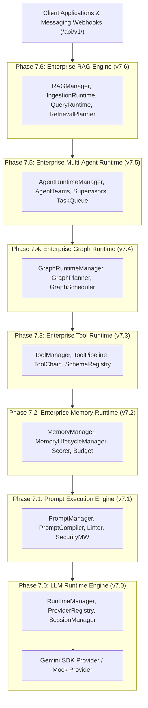
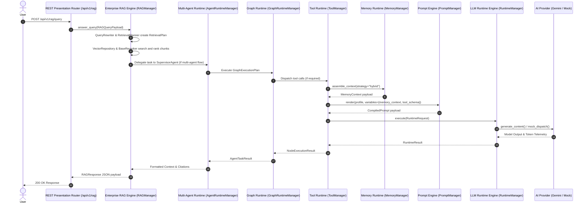

# Enterprise AI Platform Master Architecture Document

> **VOLTA Urban Mobility Platform** | **Canonical Master Architecture Reference**
> **Current Version**: `v7.6.0` | **Status**: Permanently Frozen Runtime Constitution
> **Automated Test Matrix**: **186 Tests Passing** (100% Pass Rate)

---

## 1. Executive Summary & Vision

The **VOLTA Enterprise AI Platform** is a provider-independent, framework-independent, low-latency conversational AI engine built specifically for multi-turn urban mobility messaging interactions.

The platform provides a 7-tier decoupled runtime stack:
1. **LLM Runtime Engine** (`v7.0`)
2. **Prompt Execution Engine** (`v7.1`)
3. **Enterprise Memory Runtime** (`v7.2`)
4. **Enterprise Tool Runtime** (`v7.3`)
5. **Graph Runtime Integration** (`v7.4`)
6. **Multi-Agent Orchestration Runtime** (`v7.5`)
7. **Enterprise RAG Engine** (`v7.6`)

Every tier operates exclusively through public contract interfaces. Implementation packages of frozen tiers cannot be modified by upper layers.

---

## 2. Master System Architecture Topology

---

## 3. End-to-End Request Execution Flow

---

## 4. Layer-by-Layer Architectural Breakdown

| Layer | Version | Location | Primary Responsibilities | Core Public Entry Point |
| :--- | :---: | :--- | :--- | :--- |
| **LLM Runtime Engine** | `v7.0` | `backend/app/runtime/` | Provider execution, token telemetry, retries, session tracking | `RuntimeManager` |
| **Prompt Execution Engine** | `v7.1` | `backend/app/prompt/` | Profile templates, variable compilation, linter, security sanitization | `PromptManager` |
| **Enterprise Memory Runtime** | `v7.2` | `backend/app/memory/` | Memory persistence, context assembly strategies, decay scoring, window budgets | `MemoryManager` |
| **Enterprise Tool Runtime** | `v7.3` | `backend/app/tools/` | JSON Schema discovery, tool pipelines, sequential chaining, permission policy | `ToolManager` |
| **Graph Runtime Integration** | `v7.4` | `backend/app/graph_runtime/` | StateGraph execution planning, navigation cursors, 9-stage middleware, replay state | `GraphRuntimeManager` |
| **Multi-Agent Orchestration** | `v7.5` | `backend/app/agents/` | Agent definitions, worker instances, team composition, task queues, mailbox messaging | `AgentRuntimeManager` |
| **Enterprise RAG Engine** | `v7.6` | `backend/app/rag/` | Ingestion & query runtimes, retrieval planning, pluggable reranking, citations, caching | `RAGManager` |

---

## 5. Runtime Engineering Constitution

1. **Permanent Layer Immutability**:
   - `backend/app/runtime/` (v7.0)
   - `backend/app/prompt/` (v7.1)
   - `backend/app/memory/` (v7.2)
   - `backend/app/tools/` (v7.3)
   - `backend/app/graph_runtime/` (v7.4)
   - `backend/app/agents/` (v7.5)
   - `backend/app/rag/` (v7.6)
   are permanently frozen. Upper tiers and future production connectors consume them exclusively via public interfaces.
2. **Provider & Storage Independence**:
   - Vector databases (Pinecone, Qdrant, FAISS, Chroma), document parsers (PDF, DOCX, HTML), storage backends (S3, Azure Blob, GCS), and production LLM vendors belong in reserved extension directories (`providers/`, `parsers/`, `extensions/`, `adapters/`).
3. **No Hidden Direct Model Calls**:
   - High-level orchestration layers (Graph, Multi-Agent, RAG Engine) NEVER call LLM APIs directly. They MUST delegate generation to frozen `RuntimeManager` and `PromptManager`.

---

## 6. Phase 7.7 Production Integration Roadmap

Phase 7.7 connects the frozen runtime stack abstractions to real external production infrastructure without altering core code:

1. **Vector Database Connectors**: Implement `VectorRepository` drivers for Qdrant, FAISS, Pinecone, and Chroma under `app/rag/providers/`.
2. **Document Parsers**: Implement `BaseDocumentParser` for PyPDF, python-docx, Beautiful Soup, and Unstructured under `app/rag/parsers/`.
3. **Production Embedding Providers**: Implement `EmbeddingProvider` for OpenAI (`text-embedding-3-small`), Gemini Embeddings, and Voyage AI under `app/rag/providers/`.
4. **Cloud Object Storage**: Connect `DocumentSource` to S3 / Azure Blob / GCS buckets.
5. **Observability & Telemetry**: Export `RetrievalTrace`, `ExecutionTrace`, and `RuntimeMetrics` to OpenTelemetry, Prometheus, and Jaeger.
6. **Production Deployment**: Docker containerization, Kubernetes manifests, Helm charts, CI/CD GitHub Actions pipelines, and Redis distributed caching.
