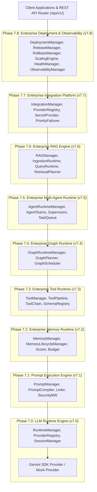

# Enterprise AI Platform Master Architecture Document

> **VOLTA Urban Mobility Platform** | **Canonical Master Architecture Reference**  
> **Current Version**: `v7.8.0` (`VOLTA AI Platform v1.0`) | **Status**: Permanently Frozen Runtime Constitution  
> **Automated Test Matrix**: **421 Tests Passing** (100% Pass Rate)

---

## 1. Executive Summary & Vision

The **VOLTA Enterprise AI Platform** is a provider-independent, framework-independent, low-latency conversational AI engine built specifically for multi-turn urban mobility messaging interactions.

The platform provides a 9-tier decoupled runtime stack:
1. **LLM Runtime Engine** (`v7.0`)
2. **Prompt Execution Engine** (`v7.1`)
3. **Enterprise Memory Runtime** (`v7.2`)
4. **Enterprise Tool Runtime** (`v7.3`)
5. **Graph Runtime Integration** (`v7.4`)
6. **Multi-Agent Orchestration Runtime** (`v7.5`)
7. **Enterprise RAG Engine** (`v7.6`)
8. **Enterprise Integration Platform** (`v7.7`)
9. **Enterprise Deployment, Scaling & Operationalization** (`v7.8`)

Every tier operates exclusively through public contract interfaces. Implementation packages of frozen tiers cannot be modified by upper layers.

---

## 2. Master System Architecture Topology

---

## 3. Runtime Layer Summary

| Tier | Package | Key Components |
|:---|:---|:---|
| **v7.0** | `backend/app/runtime/` | LLM Runtime Engine, ProviderRegistry, SessionManager |
| **v7.1** | `backend/app/prompt/` | Prompt Engine, Compiler, Template Engine, Security Middleware |
| **v7.2** | `backend/app/memory/` | Memory Runtime, Scorer, Truncation, Token Budget |
| **v7.3** | `backend/app/tools/` | Tool Runtime, Pipeline, Middleware, Chain Execution |
| **v7.4** | `backend/app/graph_runtime/` | Graph Runtime, Dynamic Planning, Parallel Execution |
| **v7.5** | `backend/app/agents/` | Multi-Agent Orchestration, Supervisor, Task Queue |
| **v7.6** | `backend/app/rag/` | Ingestion, Retrieval Planner, Hybrid Reranker, Citation Generator |
| **v7.7** | `backend/app/integrations/` | Capability Discovery, Priority Failover, Secret Rotation |
| **v7.8** | `backend/app/deployment/` | Deployment Manager, Release, Rollback, Scaling, Health, Observability |

---

## 4. Engineering Constitution

1. **Frozen Package Principle**: Lower tiers (v7.0–v7.8) are permanently frozen and immutable.
2. **Provider Independence**: No vendor SDK lock-in across storage, vector DB, LLM, auth, or cloud.
3. **Public Manager Pattern**: Inter-package interactions occur strictly through `Manager` classes.
4. **100% Non-Blocking Async**: All runtime operations are async-safe.
5. **Zero Circular Imports**: Clean tree hierarchy.
