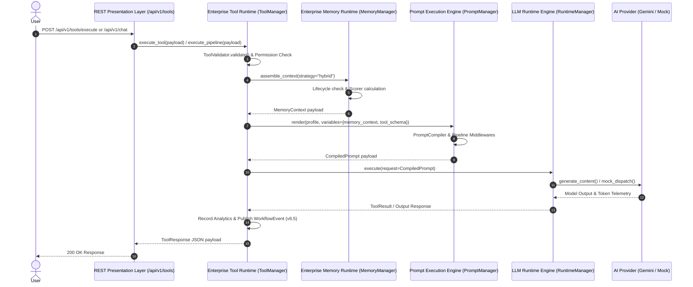
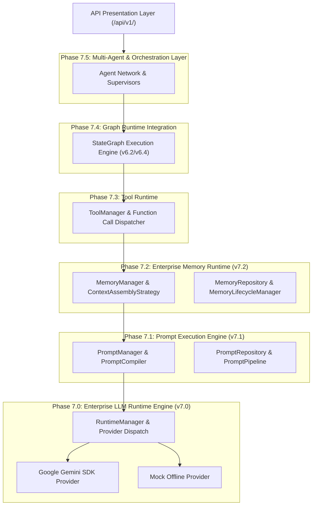
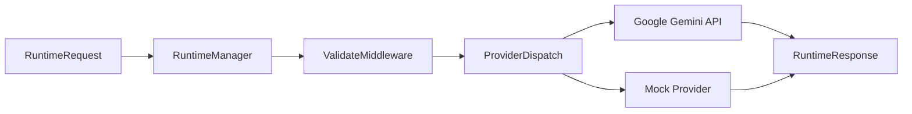
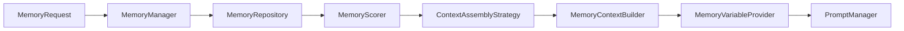

# Enterprise Messaging Runtime Architecture Blueprint (Phase 7)

> **VOLTA AI Chatbot Platform** | **Runtime Engine Architecture Blueprint**
> **Current Version**: `v7.3.0` | **Status**: Active Runtime Architecture Reference

---

## Executive Overview

The **Enterprise Messaging Runtime** is a modular, provider-independent, framework-independent conversational AI runtime engine built specifically for multi-turn mobility messaging interactions. It operates directly above the foundation infrastructure layers (v1.0 – v6.8.1) and enforces clean architectural separation between LLM execution, prompt engineering, memory orchestration, tool calling, graph state machines, multi-agent networks, and RAG retrieval.

---

## End-to-End Execution Sequence Diagram



---

## Master Runtime Stack Diagram



---

## Layer-by-Layer Architectural Breakdown

### 1. LLM Runtime Engine Layer (Phase 7.0 — `backend/app/runtime/`)
- **Status**: ✅ **COMPLETED (`v7.0.0`)**
- **Responsibilities**: Provider-independent model execution, token accounting, backoff retries, health checking, and provider dispatch (`GeminiProvider`, `MockProvider`).
- **Core Models**: `RuntimeRequest`, `RuntimeResponse`, `ChatMessage`, `RuntimeTokenUsage`, `ProviderCapabilities`.



---

### 2. Prompt Execution Engine Layer (Phase 7.1 — `backend/app/prompt/`)
- **Status**: ✅ **COMPLETED (`v7.1.0`)**
- **Responsibilities**: Decoupled prompt rendering vs execution, prompt templates, template revisions, prompt profiles, linting, validation, security policies, and compiler format translation.
- **Core Components**: `PromptManager`, `PromptProfile`, `PromptCompiler`, `PromptRepository`, `PromptPipeline`, `PromptLinter`.

```mermaid
graph LR
    PromptRequest --> PromptManager
    PromptManager --> Pipeline["PromptPipeline (Validate, Security, Inject, Render, Optimize, Audit)"]
    Pipeline --> PromptResult
    PromptResult + PromptProfile --> PromptCompiler
    PromptCompiler --> CompiledPrompt
    CompiledPrompt --> RuntimeManager
```

---

### 3. Enterprise Memory Runtime Layer (Phase 7.2 — `backend/app/memory/`)
- **Status**: ✅ **COMPLETED (`v7.2.0`)**
- **Responsibilities**: Conversation memory orchestration, lifecycle transitions (`CREATED` ➔ `ACTIVE` ➔ `PINNED` ➔ `ARCHIVED` ➔ `EXPIRED` ➔ `DELETED`), retrieval scoring, context assembly strategies (`Recent`, `Importance`, `Hybrid`, `SlidingWindow`), and token window budget management.
- **Core Components**: `MemoryManager`, `MemoryLifecycleManager`, `ContextAssemblyStrategy`, `MemoryContextBuilder`, `MemoryVariableProvider`, `MemoryRepository` ABC.



---

### 4. Tool Runtime Layer (Phase 7.3 — `backend/app/tools/`)
- **Status**: ✅ **COMPLETED (`v7.3.0`)**
- **Responsibilities**: Tool registration, JSON Schema discovery, permission authorization, policy enforcement, 6-step pipeline execution, sequential chaining, built-in reference tools, and telemetry dispatch.
- **Core Components**: `ToolManager`, `ToolRegistry`, `BaseTool`, `ToolSchema`, `ToolManifest`, `ToolPipeline`, `ToolChain`, `ToolDiscoveryService`.

---

### 5. Graph Runtime Integration Layer (Phase 7.4 — `backend/app/graph/`)
- **Status**: 📅 **PLANNED (`v7.4.0`)**
- **Responsibilities**: Seamless integration between Phase 6.2 `StateGraph`, node execution dispatcher, conditional edge evaluation, runtime prompt execution, and memory context updates.

---

### 6. Enterprise Multi-Agent Orchestration Runtime Layer (Phase 7.5 — `backend/app/agents/`)
- **Status**: 📅 **PLANNED (`v7.5.0`)**
- **Responsibilities**: Agent registry, agent runtime execution, agent scheduler, agent communication, agent memory, agent planning, agent delegation, coordinator & supervisor agents.

---

### 7. RAG Engine Layer (Phase 7.6 — `backend/app/rag/`)
- **Status**: 📅 **PLANNED (`v7.6.0`)**
- **Responsibilities**: Document ingestion, embedding generation, vector store repository adapters (Pinecone, Chroma, Qdrant, FAISS), semantic retrieval, and grounding verification.

---

### 8. Deployment & Scaling (Phase 7.8 — `infrastructure/`)
- **Status**: 📅 **PLANNED (`v7.8.0`)**
- **Responsibilities**: Production Docker containers, Kubernetes manifests, horizontal autoscaling, distributed caching, and end-to-end monitoring.

---

## Future Phase Integration Matrix

| Sub-Phase | Architectural Layer | Primary Entry Point | Dependencies |
| :--- | :--- | :--- | :--- |
| **v7.0** | Enterprise LLM Runtime Engine | `app.runtime.RuntimeManager` | `google-genai` SDK |
| **v7.1** | Prompt Execution Engine | `app.prompt.PromptManager` | `app.runtime` |
| **v7.2** | Enterprise Memory Runtime | `app.memory.MemoryManager` | `app.prompt`, `app.events` |
| **v7.3** | Tool Runtime | `app.tools.ToolManager` | `app.memory`, `app.runtime` |
| **v7.4** | Graph Runtime Integration | `app.graph.GraphEngine` | `app.execution`, `app.tools` |
| **v7.5** | Multi-Agent Runtime | `app.agents.AgentSupervisor` | `app.graph`, `app.prompt` |
| **v7.6** | RAG Engine | `app.rag.RAGEngine` | `app.memory`, `app.ai` |
| **v7.7** | Production Integrations | `app.services.ChatService` | All runtime layers |
| **v7.8** | Deployment & Scaling | Deployment Manifests | Infrastructure |
