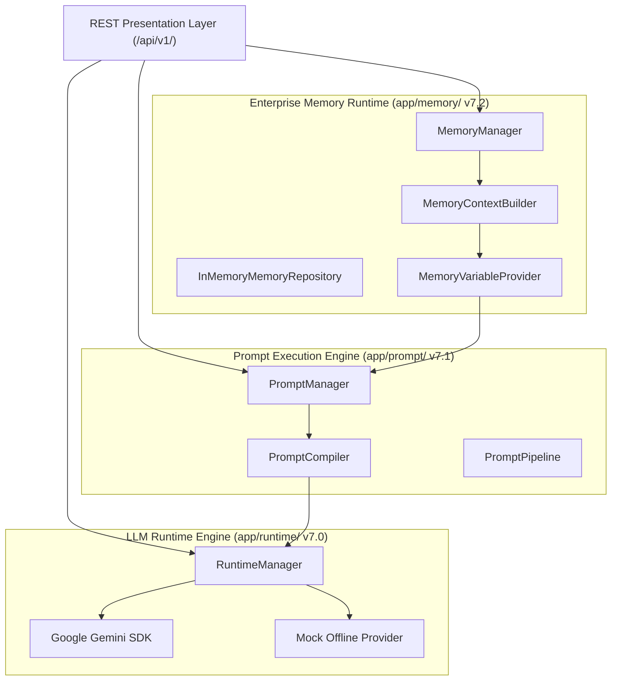
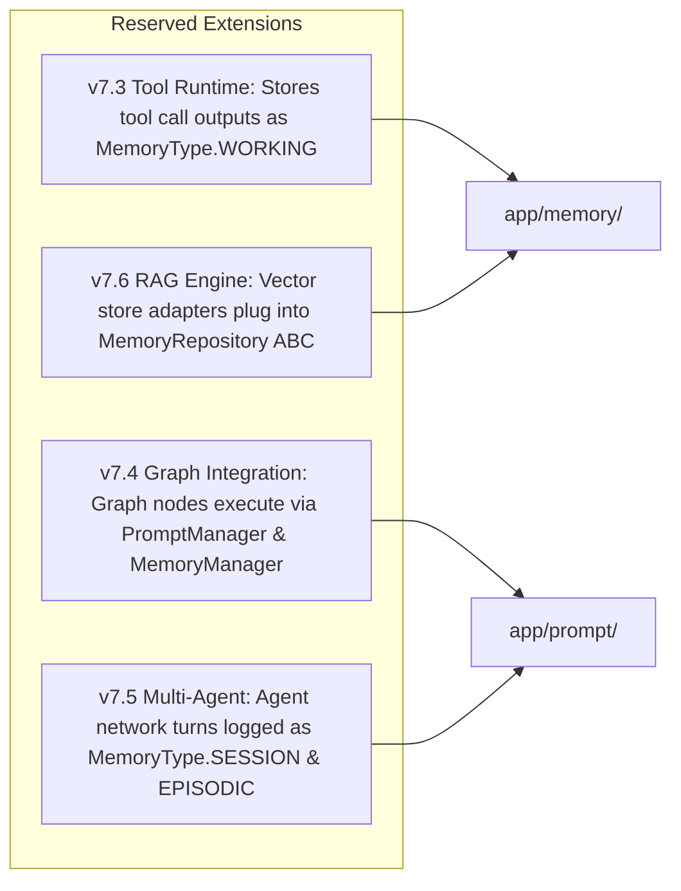

# Runtime Baseline Snapshot — v7.2.0

> **VOLTA AI Chatbot Platform** | **Enterprise Messaging Runtime Baseline**
> **Release Version**: `v7.2.0` | **Tag**: `v7.2` | **Date**: 2026-08-07
> **Automated Test Count**: **156 Tests Passing** (100% Pass Rate)

---

## 1. Freeze Declaration

As of version `v7.2.0` (Git Tag `v7.2`, Commit `6d08e0c`), all components under the **Enterprise LLM Runtime Engine (v7.0)**, **Prompt Execution Engine (v7.1)**, and **Enterprise Memory Runtime (v7.2)** are hereby declared **FROZEN AND IMMUTABLE**.

Subsequent sub-phases (Phase 7.3 Tool Runtime through Phase 7.8 Deployment) will strictly integrate with these interfaces without modifying core contract implementations.

---

## 1.1 Runtime Stability Rules (Phase 7 Engineering Constitution)

All remaining runtime sub-phases (Phase 7.3 – Phase 7.8) MUST obey the following 10 architectural stability rules:

1. **Runtime Engine is immutable**: `backend/app/runtime/` interfaces and contracts remain locked.
2. **Prompt Engine is immutable**: `backend/app/prompt/` interfaces and contracts remain locked.
3. **Memory Runtime is immutable**: `backend/app/memory/` interfaces and contracts remain locked.
4. **Future phases may extend, never modify**: New features add new modules/providers without mutating existing implementations.
5. **Public interface communication only**: Inter-layer communication MUST occur through public interface contracts.
6. **No internal implementation leakage**: No runtime layer may bypass public abstractions to access internal implementations.
7. **Strict provider independence**: Every new runtime phase MUST remain 100% independent of vendor-specific SDKs, databases, vector stores, or APIs.
8. **100% backward compatibility**: Every release MUST preserve existing API contracts and public schemas.
9. **Coverage preservation**: Every release MUST maintain or increase total automated test coverage (never decreasing pass counts).
10. **Disciplined Release Definition of Done**: Every sub-phase MUST conclude with:
    - Architecture Decision Record (ADR)
    - Baseline snapshot
    - Git release tag
    - Full documentation synchronization
    - Clean working tree & git commit history

---

## 2. Runtime Stack Status (v7.0 – v7.2)

| Layer / Sub-Phase | Version | Package Path | Status | Key Abstractions |
| :--- | :---: | :--- | :---: | :--- |
| **LLM Runtime Engine** | `v7.0.0` | `backend/app/runtime/` | 🔒 **LOCKED** | `RuntimeManager`, `RuntimeProvider` ABC, `GeminiProvider`, `MockProvider`, `RuntimeSession`, `RuntimeExecutionStore` |
| **Prompt Execution Engine** | `v7.1.0` | `backend/app/prompt/` | 🔒 **LOCKED** | `PromptManager`, `PromptProfile`, `PromptCompiler`, `PromptRepository` ABC, `PromptLinter`, `VariableProvider` ABC |
| **Enterprise Memory Runtime** | `v7.2.0` | `backend/app/memory/` | 🔒 **LOCKED** | `MemoryManager`, `MemoryLifecycleManager`, `ContextAssemblyStrategy` ABC, `MemoryVariableProvider`, `MemoryRepository` ABC |

---

## 3. Layer Dependency Graph

---

## 4. Public API Interfaces

### A. LLM Runtime Engine (`/api/v1/runtime`)
- `POST /api/v1/runtime/chat`: Execute LLM runtime turn (`RuntimeRequest` ➔ `RuntimeResponse`).
- `POST /api/v1/runtime/providers/health`: Check health of registered runtime providers.

### B. Prompt Execution Engine (`/api/v1/prompts`)
- `POST /api/v1/prompts/render`: Render and validate prompt template (`PromptRequest` ➔ `PromptResult`).
- `POST /api/v1/prompts/execute`: Render and execute prompt through LLM Runtime Engine.
- `POST /api/v1/prompts/sandbox/execute`: Execute unsaved scratch prompt in sandbox mode.
- `POST /api/v1/prompts/compare`: Side-by-side provider output comparison (Mock vs Gemini).

### C. Enterprise Memory Runtime (`/api/v1/memory`)
- `POST /api/v1/memory`: Create memory record (`MemoryRequest` ➔ `Memory`).
- `GET /api/v1/memory`: List stored memories with optional conversation or status filter.
- `GET /api/v1/memory/{id}`: Retrieve memory details by UUID.
- `DELETE /api/v1/memory/{id}`: Delete memory record.
- `POST /api/v1/memory/search`: Search and score memories (`MemorySearchResult`).
- `POST /api/v1/memory/context`: Assemble structured `MemoryContext` & context window budget.
- `POST /api/v1/memory/cleanup`: Execute retention policy cleanup.
- `GET /api/v1/memory/metrics`: Memory execution metrics.
- `GET /api/v1/memory/statistics`: Repository state snapshot statistics.
- `GET /api/v1/memory/health`: Memory Runtime health status report.

---

## 5. Integration Points Reserved for v7.3 – v7.8

---

## 6. Test Suite & Verification Matrix

- **Total Test Count**: **156 Tests Passing** (100% Pass Rate).
- **Execution Speed**: 4.05 seconds.
- **Strict Asyncio Mode**: Enabled (`asyncio_mode = "strict"`).
- **Circular Import Checks**: Zero circular dependencies verified across `app.runtime`, `app.prompt`, `app.memory`, and `app`.
