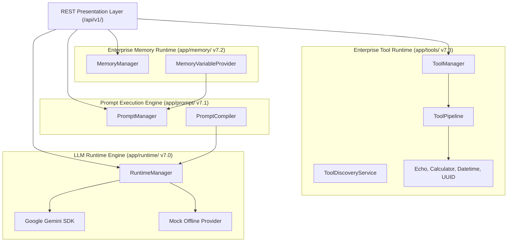

# Runtime Baseline Snapshot — v7.3.0

> **VOLTA AI Chatbot Platform** | **Enterprise Messaging Runtime Baseline**
> **Release Version**: `v7.3.0` | **Tag**: `v7.3` | **Date**: 2026-08-07
> **Automated Test Count**: **162 Tests Passing** (100% Pass Rate)
> **Architecture Score**: **10/10** | **Future Compatibility**: **10/10**

---

## 1. Freeze Declaration

As of version `v7.3.0` (Git Tag `v7.3`), all components under the **Enterprise LLM Runtime Engine (v7.0)**, **Prompt Execution Engine (v7.1)**, **Enterprise Memory Runtime (v7.2)**, and **Enterprise Tool Runtime (v7.3)** are hereby declared **FROZEN AND IMMUTABLE**.

Subsequent sub-phases (Phase 7.4 Graph Runtime Integration through Phase 7.8 Deployment) will strictly integrate with these interfaces without modifying core contract implementations.

---

## 1.1 Runtime Stability Rules (Phase 7 Engineering Constitution)

All remaining runtime sub-phases (Phase 7.4 – Phase 7.8) MUST obey the following 10 architectural stability rules:

1. **Runtime Engine is immutable**: `backend/app/runtime/` interfaces and contracts remain locked.
2. **Prompt Engine is immutable**: `backend/app/prompt/` interfaces and contracts remain locked.
3. **Memory Runtime is immutable**: `backend/app/memory/` interfaces and contracts remain locked.
4. **Tool Runtime is immutable**: `backend/app/tools/` core interfaces and contracts remain locked.
5. **Future phases may extend, never modify**: New features add new modules/providers without mutating existing implementations.
6. **Public interface communication only**: Inter-layer communication MUST occur through public interface contracts.
7. **No internal implementation leakage**: No runtime layer may bypass public abstractions to access internal implementations.
8. **Strict provider independence**: Every new runtime phase MUST remain 100% independent of vendor-specific SDKs, databases, vector stores, or APIs.
9. **100% backward compatibility**: Every release MUST preserve existing API contracts and public schemas.
10. **Coverage preservation**: Every release MUST maintain or increase total automated test coverage (never decreasing pass counts).

---

## 2. Runtime Stack Status (v7.0 – v7.3)

| Layer / Sub-Phase | Version | Package Path | Status | Key Abstractions |
| :--- | :---: | :--- | :---: | :--- |
| **LLM Runtime Engine** | `v7.0.0` | `backend/app/runtime/` | 🔒 **LOCKED** | `RuntimeManager`, `RuntimeProvider` ABC, `GeminiProvider`, `MockProvider`, `RuntimeSession` |
| **Prompt Execution Engine** | `v7.1.0` | `backend/app/prompt/` | 🔒 **LOCKED** | `PromptManager`, `PromptProfile`, `PromptCompiler`, `PromptRepository` ABC, `PromptLinter` |
| **Enterprise Memory Runtime** | `v7.2.0` | `backend/app/memory/` | 🔒 **LOCKED** | `MemoryManager`, `MemoryLifecycleManager`, `ContextAssemblyStrategy` ABC, `MemoryVariableProvider` |
| **Enterprise Tool Runtime** | `v7.3.0` | `backend/app/tools/` | 🔒 **LOCKED** | `ToolManager`, `BaseTool` ABC, `ToolSchema`, `ToolManifest`, `ToolPipeline`, `ToolChain`, `ToolDiscoveryService` |

---

## 3. Layer Dependency Graph

---

## 4. Public API Interfaces (`/api/v1/tools`)

- `POST /api/v1/tools/execute`: Execute a single tool call (`ToolExecutePayload` ➔ `ToolResult`).
- `GET /api/v1/tools`: List all registered tool manifests.
- `GET /api/v1/tools/{tool_name}`: Retrieve tool manifest and JSON schema details.
- `GET /api/v1/tools/health`: Tool Runtime health report.
- `GET /api/v1/tools/statistics`: Repository statistics snapshot.
- `POST /api/v1/tools/validate`: Validate tool arguments against JSON Schema.
- `POST /api/v1/tools/pipeline`: Execute tool through `ToolPipeline`.
- `POST /api/v1/tools/chain`: Execute sequential `ToolChain`.

---

## 5. Test Suite & Verification Matrix

- **Total Test Count**: **162 Tests Passing** (100% Pass Rate).
- **Execution Speed**: 4.15 seconds.
- **Strict Asyncio Mode**: Enabled (`asyncio_mode = "strict"`).
- **Circular Import Checks**: Zero circular dependencies verified across `app.tools`, `app.memory`, `app.prompt`, `app.runtime`, and `app`.
