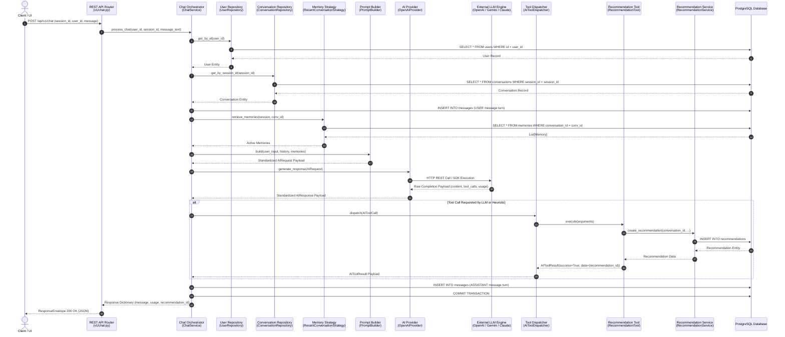

# ADR 019: AI Engine Request Flow & Execution Architecture

## Status
Accepted

## Date
2026-08-04

---

## Executive Summary
This document provides the authoritative end-to-end request flow diagram and layer-by-layer specification for conversational AI requests processed by the VOLTA platform. It details the complete invocation sequence from the client interface down to external LLMs, tool dispatching, repository persistence, and response envelopes.

---

## 1. End-to-End Execution Sequence Diagram

---

## 2. Comprehensive Layer Breakdown

### Stage 1: REST API Presentation Layer (`app/api/v1/routers/chat.py`)
- **Responsibility**: Authenticates incoming HTTP payloads, validates request schemas via Pydantic v2 `ChatRequestDTO`, resolves FastAPI dependency injections (`get_chat_service`), and formats output into standard `ResponseEnvelope[ChatResponseDTO]`.
- **Contracts**: Inputs raw JSON payload; outputs standardized HTTP response envelope.

### Stage 2: Chat Orchestrator (`app/services/chat.py`)
- **Responsibility**: Acts as high-level application orchestrator. Coordinates user validation, conversation retrieval/creation, message history fetching, memory strategy invocation, prompt assembly, AI provider generation, tool execution, turn persistence, and transactional commit.
- **Contracts**: Pure orchestration logic; delegates all domain execution.

### Stage 3: Data Access & Repositories (`app/repositories/`)
- **Responsibility**: Provides async CRUD operations (`get_by_id`, `create`, `count`, custom queries) targeting PostgreSQL tables via SQLAlchemy `AsyncSession`.
- **Contracts**: Accepts domain entities/dictionaries; returns typed ORM models.

### Stage 4: Memory Strategy (`app/ai/memory/`)
- **Responsibility**: Implements `MemoryStrategy` interface (`retrieve_memories`). Extracts episodic memories and key-value context tied to active conversations.
- **Contracts**: Fully pluggable interface; isolated from LLM provider details.

### Stage 5: Centralized Prompt Builder (`app/ai/prompts/prompt_builder.py`)
- **Responsibility**: Merges system prompt (`VOLTA_SYSTEM_PROMPT`), user memory summaries, conversation message history, and incoming message text into a provider-agnostic `AIRequest` payload.
- **Contracts**: Pure formatting component; zero repository or provider calls.

### Stage 6: Provider-Independent AI Engine (`app/ai/providers/`)
- **Responsibility**: Implements `AIProvider` base class (`generate_response`). Translates standardized `AIRequest` into vendor-specific API calls (OpenAI, Gemini, Claude, Ollama) and maps raw completions back into standardized `AIResponse` payloads.
- **Contracts**: Completely isolates third-party SDK dependencies.

### Stage 7: Tool Execution Framework (`app/ai/tools/`)
- **Responsibility**: `AIToolDispatcher` routes tool execution requests (`AIToolCall`) to registered tool implementations (`RecommendationTool`). Tools interact with domain application services (`RecommendationService`), which write data to the database.
- **Contracts**: LLMs request tool execution via structured metadata; business logic executes cleanly inside service layers.

### Stage 8: Transaction Boundary & Database Persistence
- **Responsibility**: Ensures user input turn, assistant output turn, and any domain entities created via tool calls commit atomically within a single `AsyncSession.commit()`.
