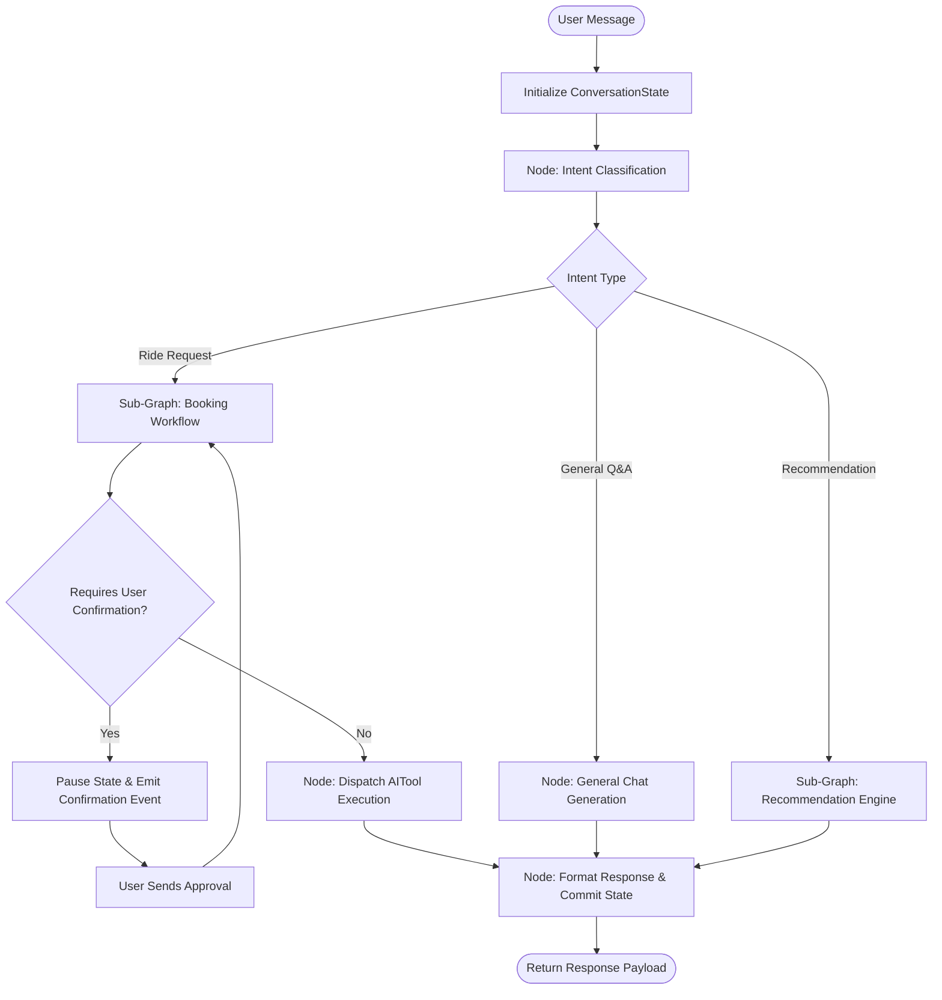

# ADR 020: Phase 6 Architectural Readiness Review & LangGraph Strategy

## Status
Accepted

## Date
2026-08-04

---

## 1. Executive Summary
This Architectural Decision Record (ADR) establishes the formal readiness review of the VOLTA AI Chatbot backend platform prior to transitioning from **Phase 5.0 (Enterprise AI Foundation)** into **Phase 6.0 (LangGraph Workflows & Real-Time Orchestration)**.

All 7 core foundation tiers—Infrastructure, Database, Domain Models, Repositories, Services, REST API presentation, and Provider-Agnostic AI Engines—are fully implemented, locked, and validated by a 100% passing test suite (45/45 tests).

---

## 2. Completed Architecture Overview

| Layer | Component | Status | Lock Version |
| :--- | :--- | :--- | :--- |
| **Infrastructure** | FastAPI Core, Settings, Exception Handlers, Async Engine | **LOCKED** | `v1.0` |
| **Database** | PostgreSQL Async SQLAlchemy, Alembic Engine, Base Mixins | **LOCKED** | `v1.1` |
| **Domain Models** | `User`, `Conversation`, `Message`, `Recommendation`, `Booking`, etc. | **LOCKED** | `v2.0` |
| **Repositories** | `BaseRepository[T]`, `UserRepository`, `ConversationRepository`, etc. | **LOCKED** | `v2.5` |
| **Service Layer** | `BaseService`, `UserService`, `ConversationService`, `ChatService` | **LOCKED** | `v3.0` |
| **REST Presentation**| Versioned Routers `/api/v1/`, Pydantic DTOs, Service Injections | **LOCKED** | `v4.0` |
| **AI Foundation** | `AIProvider`, `PromptBuilder`, `MemoryStrategy`, `AIToolDispatcher` | **LOCKED** | `v5.0` |

---

## 3. Why Phase 6 is Now Possible
1. **Provider Isolation**: Decoupled `AIProvider` interface allows plugging in LangGraph agent nodes without locking into vendor-specific APIs.
2. **Standardized Tool Execution**: `AIToolDispatcher` and `AIToolRegistry` provide a ready mechanism for LangGraph agents to execute domain services (`RecommendationService`, `BookingService`).
3. **State Management Boundary**: Introduced `ConversationState` schema and `ConversationStateManager` interface in `app/context/state_manager.py`, creating the foundation for agent workflow state persistence.
4. **Clean Transaction Scope**: `ChatService` manages clear database transaction boundaries (`commit`/`rollback`), allowing state checkpoints to persist cleanly.

---

## 4. Phase 6 Responsibilities & Orchestration Goals

### Primary Responsibilities of Phase 6:
- **LangGraph State Graph Workflows**: Introduce multi-step state graph execution for multi-turn ride booking, route clarification, and recommendation choices.
- **Intent & Entity Graph Nodes**: Dedicated state graph nodes for fine-grained intent classification and entity extraction (pickup location, destination, vehicle preference).
- **Human-in-the-Loop (HITL) Interruption**: Ability to pause execution graph state when waiting for user confirmation (e.g. confirming fare & vehicle tier) and resume seamlessly.
- **Episodic & Vector Memory Strategy Integration**: Expand `MemoryStrategy` to support PGVector / Qdrant semantic memory retrieval alongside `RecentConversationStrategy`.
- **Real-Time & Streaming Readiness**: Structure workflow state transitions to support streaming tokens over WebSockets for Phase 7 Enterprise Messaging Runtime and Phase 8 Voice Platform integration.

---

## 5. LangGraph Integration Strategy

---

## 6. Risk Assessment & Mitigation

| Risk Area | Impact | Severity | Mitigation Strategy |
| :--- | :--- | :--- | :--- |
| **Workflow State Explosion** | Unbounded session state size in DB/Redis | **Medium** | Enforce TTLs and strict Pydantic `ConversationState` schemas. |
| **Tool Execution Latency** | Sequential tool calls stalling response time | **Medium** | Async concurrent tool execution via `AIToolDispatcher`. |
| **LangGraph Dependency Leak**| Coupling business logic directly to LangGraph SDK | **High** | Wrap LangGraph graphs inside `app/ai/workflows/` behind service boundaries. |
| **Context Window Overflow**| Extended conversation histories exceeding token limits | **Low** | Token truncation in `PromptBuilder` & summary memory compression strategies. |

---

## 7. Formal Readiness Verdict
**Phase 6 Status**: **APPROVED FOR EXECUTION**
The Enterprise AI Foundation architecture is verified, stable, decoupled, and fully prepared for Phase 6 multi-agent and LangGraph integration.
