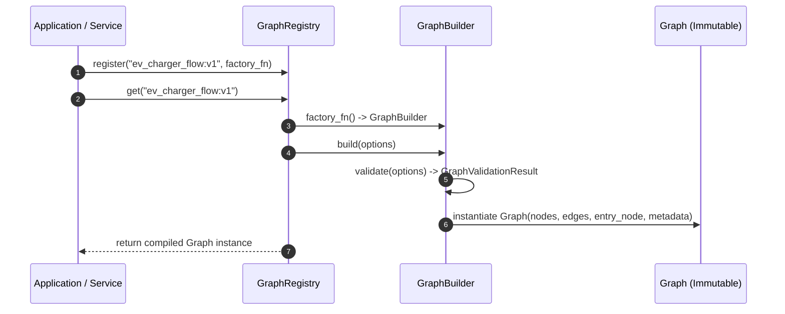

# 022 - Graph Orchestration Foundation Architecture

**Status**: Accepted  
**Date**: August 4, 2026  
**Scope**: Foundation Architecture (Phase 6.2)

---

## 1. Purpose

The Graph Orchestration Foundation establishes a clean, vendor-independent, framework-isolated graph orchestration infrastructure layer (`backend/app/graph/`). It defines abstract node, edge, graph, builder, and template registry abstractions that serve as the foundational execution fabric for all future AI orchestration workflows in the Volta AI Chatbot platform.

> **Vendor Independence Guarantee**: While initially designed to support LangGraph integration, the core orchestration layer remains completely provider-agnostic. It can seamlessly support alternative runtime orchestrators (CrewAI, Semantic Kernel, or custom execution engines) without structural modification to the infrastructure tier.

---

## 2. Design Goals

- **Vendor Independence**: Zero coupling to LLM providers (OpenAI, Claude, Gemini, Ollama) or specific graph runner frameworks.
- **Framework Isolation**: Zero coupling to web frameworks (FastAPI), database ORMs (SQLAlchemy), or external caching infrastructure (Redis).
- **Pure Abstraction**: Contains zero business logic, zero booking/recommendation flows, zero tool execution, and zero prompt templates.
- **SOLID Compliance**: Strict interface segregation via protocol contracts, composition over inheritance, and open/closed extensibility.
- **Async-Ready**: Built for 100% native asynchronous execution.

---

## 3. Architecture & Component Interaction

```
┌─────────────────────────────────────────────────────────────────────────────┐
│                            GraphRegistry                                    │
│       (Manages & lazy-instantiates named Graph templates)                   │
└──────────────────────────────────────┬──────────────────────────────────────┘
                                       │ .get("template_name")
                                       ▼
┌─────────────────────────────────────────────────────────────────────────────┐
│                            GraphBuilder                                     │
│   - Registers BaseNode components                                          │
│   - Registers GraphEdge transitions (unconditional & conditional)          │
│   - Validates node uniqueness & orphan edges via GraphBuildOptions         │
│   - Enforces optional cycle detection                                      │
└──────────────────────────────────────┬──────────────────────────────────────┘
                                       │ .build()
                                       ▼
┌─────────────────────────────────────────────────────────────────────────────┐
│                             Graph (Immutable)                               │
│   - Read-only node lookup table (_nodes)                                   │
│   - Priority-indexed adjacency list (_adjacency)                           │
│   - Entrypoint node reference (_entry_node)                                │
│   - Standardized GraphMetadata reference (_metadata)                       │
└─────────────────────────────────────────────────────────────────────────────┘
```

---

## 4. Contract Placeholders & DTO Schema

The foundation establishes explicit DTO contracts for validation, compilation, and execution:

```
┌───────────────────────────┐      ┌───────────────────────────┐
│       GraphMetadata       │      │     GraphBuildOptions     │
├───────────────────────────┤      ├───────────────────────────┤
│ name: str                 │      │ allow_cycles: bool = True │
│ version: str              │      │ strict_validation: bool   │
│ description: str          │      │ sort_edges: bool = True   │
│ author: str               │      │ compile_indexes: bool     │
│ created_at / updated_at   │      └───────────────────────────┘
│ tags: list[str]           │
│ execution_mode            │      ┌───────────────────────────┐
└───────────────────────────┘      │      ExecutionResult      │
                                   ├───────────────────────────┤
┌───────────────────────────┐      │ execution_id: UUID        │
│   GraphValidationResult   │      │ status: WorkflowStatus    │
├───────────────────────────┤      │ final_state: State        │
│ is_valid: bool            │      │ duration_ms: float        │
│ warnings: list[str]       │      │ visited_nodes: list[str]  │
│ errors: list[str]         │      │ errors: list[dict]        │
│ statistics: dict          │      │ metadata: dict            │
└───────────────────────────┘      └───────────────────────────┘
```

---

## 5. Module Responsibilities

| Module | Primary Responsibility | Key Classes / Interfaces |
| :--- | :--- | :--- |
| **`contracts.py`** | Defines pure abstract contracts, DTO placeholders, and protocols. | `IGraphNode`, `IGraphEdge`, `IGraph`, `IGraphBuilder`, `IGraphExecutor`, `IGraphRegistry`, `GraphMetadata`, `GraphBuildOptions`, `GraphValidationResult`, `ExecutionResult` |
| **`exceptions.py`** | Typed exception hierarchy for structural and runtime errors. | `GraphException`, `BuilderException`, `DuplicateNodeException`, `DuplicateEdgeException`, `NodeNotFoundException`, `GraphValidationException`, `RegistryException` |
| **`node.py`** | Base abstract node model that future pipeline nodes inherit. | `BaseNode(BaseModel, IGraphNode, ABC)` |
| **`edge.py`** | Directed edge container supporting priority & conditional predicates. | `GraphEdge(BaseModel, IGraphEdge)` |
| **`graph.py`** | Compiled, immutable read-only graph data model with adjacency indexing. | `Graph(IGraph)` |
| **`builder.py`** | Fluent builder for assembling, validating, and compiling graphs. | `GraphBuilder(IGraphBuilder)` |
| **`registry.py`** | Template registry supporting lazy builder resolution and template lookup. | `GraphRegistry(IGraphRegistry)` |

---

## 6. Component Interaction Sequence (Mermaid Diagram)



---

## 7. Graph Validation Rules

The `GraphBuilder` enforces the following validation invariants prior to compilation:

1. **Node Uniqueness**: Rejects duplicate `node_id` registrations (`DuplicateNodeException`).
2. **Edge Uniqueness**: Rejects identical directed edges with matching source, target, condition, and priority (`DuplicateEdgeException`).
3. **Orphan Edge Prevention**: Ensures all edge `source_node` and `target_node` IDs exist in the registered node set (`GraphValidationException`).
4. **Entry Node Verification**: Ensures designated `entry_node` exists in the graph (`NodeNotFoundException`).
5. **Cycle Detection**: Performs Depth-First Search (DFS) state traversal when `options.allow_cycles=False` is configured, rejecting cyclic dependencies (`GraphValidationException`).

---

## 8. Extension Points & Future Integration Roadmap

- **Registry Versioning**: Template naming supports semantic version tags (`workflow_name:v1`, `workflow_name:v2`).
- **Node Execution Lifecycle**: Future node execution pipeline will support lifecycle hooks (`before_execute()` -> `execute()` -> `after_execute()`).
- **Graph Visualization**: Graph structure export to Mermaid, DOT, PlantUML, and JSON formats for debugging and UI visualization.
- **Execution Telemetry & Metrics**: `ExecutionResult` will track `duration_ms`, `visited_nodes`, `tool_calls`, and `token_metrics`.
- **Phase 6.3 — Workflow Node Library**: Specialized nodes (Intent, Memory, Entity, Guardrail) inherit from `BaseNode`.
- **Phase 6.4 — Graph Execution Engine**: Async graph runner executing nodes according to `Graph` adjacency lists and `ExecutionResult` contracts.

---

## 9. Risk Register

| Risk | Severity | Mitigation Strategy |
| :--- | :--- | :--- |
| **Cyclic graph deadlocks** | Medium | Configurable DFS cycle detection in `GraphBuilder.validate(options=GraphBuildOptions(allow_cycles=False))`. |
| **Overly complex edge predicates** | Low | Support both async/sync callables and string-keyed state lookups in `GraphEdge.evaluate()`. |
| **Lazy template resolution failures** | Low | `GraphRegistry.get()` catches factory errors and wraps them in `RegistryException`. |

---

## 10. Explicit Non-Goals

This chapter intentionally **DOES NOT** include:
- ❌ Graph execution runner implementation
- ❌ LLM provider calls or prompt engineering
- ❌ Business domain logic (EV charging, booking, recommendations)
- ❌ Database models, SQLAlchemy queries, or repositories
- ❌ Redis state storage or caching code
- ❌ FastAPI web endpoints or HTTP routers
- ❌ Tool execution implementations
- ❌ Modifications to Phase 6.1 `ConversationState`
