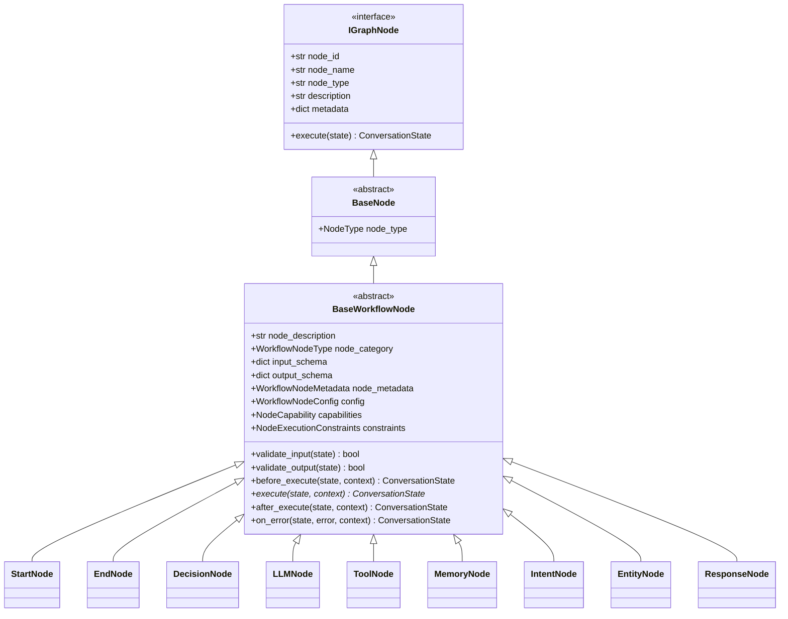

# 024: Workflow Node Library Architecture

## Purpose

The **Workflow Node Library** provides a modular, reusable, and framework-independent collection of node contracts. Built on top of the Graph Orchestration Foundation (Phase 6.2) and Conversation State Foundation (Phase 6.1), these nodes serve as contract placeholders that will later be assembled into executable AI workflows without coupling to specific vendor SDKs, databases, or runtime execution engines.

---

## Key Responsibilities

1. **Contract Definition**: Define standardized execution signatures, validation hooks, metadata schemas, capabilities, and configuration models for workflow nodes.
2. **Stateless Operations**: Guarantee that node instances remain completely stateless across execution passes.
3. **Registry & Discovery**: Offer thread-safe node registration, category filtering, search, duplicate prevention, and lazy loading.
4. **Lifecycle Hooks**: Expose standardized hooks (`before_execute`, `execute`, `after_execute`, `on_error`) with pass-through default implementations.

---

## Architectural Rules

> [!IMPORTANT]
> **Stateless Node Rule**: Workflow nodes are strictly stateless. They must NEVER maintain runtime execution state within instance attributes between executions. All dynamic runtime state belongs exclusively in `ConversationState`.

> [!WARNING]
> **No Direct Side Effects Rule**: A workflow node MUST NOT produce irreversible external side effects directly (e.g., direct PostgreSQL/SQLAlchemy database writes, sending emails, processing payments, or calling external REST APIs). Irreversible side-effects must always be delegated to dedicated backend services or tools.

---

## Node Hierarchy

```
                                  +-------------------+
                                  |    IGraphNode     |
                                  +---------+---------+
                                            |
                                  +---------v---------+
                                  |     BaseNode      |
                                  +---------+---------+
                                            |
                                  +---------v---------+
                                  |  BaseWorkflowNode |
                                  +----+----+----+----+
                                       |    |    |
       +-------------------------------+    |    +-------------------------------+
       |                                    |                                    |
+------v------+                      +------v------+                      +------v------+
|  StartNode  |                      |   LLMNode   |                      |   EndNode   |
+-------------+                      +-------------+                      +-------------+
|  Decision   |                      |  ToolNode   |                      |  Response   |
+-------------+                      +-------------+                      +-------------+
| MemoryNode  |                      | IntentNode  |                      | EntityNode  |
+-------------+                      +-------------+                      +-------------+
```

### Class Diagram (Mermaid)



---

## Node Lifecycle & Execution Contracts

Every node follows a four-stage execution lifecycle:

1. **`before_execute(state, context)`**: Validates input schema constraints and prepares state before main execution.
2. **`execute(state, context)`**: Performs primary node transformation logic.
3. **`after_execute(state, context)`**: Validates output schema constraints and formats state.
4. **`on_error(state, error, context)`**: Error handling hook invoked if any stage encounters an exception.

```
       +-----------------------+
       |     Incoming State    |
       +-----------+-----------+
                   |
                   v
       +-----------------------+
       |   before_execute()    |  --> validate_input()
       +-----------+-----------+
                   |
                   v
       +-----------------------+
       |       execute()       |  --> Main Node Transformation
       +-----------+-----------+
                   |
                   v
       +-----------------------+
       |    after_execute()    |  --> validate_output()
       +-----------+-----------+
                   |
                   v
       +-----------------------+
       |     Outgoing State    |
       +-----------------------+
```

---

## Node Categories

Nodes are categorized into standard types via `WorkflowNodeType`:
- `START`: Entrypoint nodes
- `END`: Terminal nodes
- `LLM`: AI model inference contracts
- `TOOL`: Function and integration contracts
- `MEMORY`: State retrieval and persistence contracts
- `INTENT`: Classification contracts
- `ENTITY`: Entity extraction contracts
- `DECISION`: Conditional branching contracts
- `RESPONSE`: Output formatting contracts
- `SYSTEM`: System operations contracts (logging, metrics, checkpoints)
- `CUSTOM`: User-defined node extensions

---

## Future Execution Engine Contracts (`NodeResult`)

To prepare for the Graph Execution Engine (Phase 6.4), the library defines the `NodeResult` contract model:

```python
class NodeResult(BaseModel):
    state: Optional[ConversationState] = None
    status: WorkflowStatus = WorkflowStatus.COMPLETED
    next_node: Optional[str] = None
    metadata: dict[str, Any] = Field(default_factory=dict)
    warnings: list[str] = Field(default_factory=list)
    execution_time: float = 0.0
    outputs: dict[str, Any] = Field(default_factory=dict)
```

---

## Extension Model & Node Registry

The `WorkflowNodeRegistry` provides:
- **Registration**: `register(node, node_id, overwrite)`
- **Discovery**: `lookup(node_id)`, `list()`, `list_categories()`, `list_types()`, `search(query)`, `exists(node_id)`, `list_by_category(category)`
- **Metadata Inspection**: `get_metadata(node_id)`
- **Safety**: `DuplicateWorkflowNodeException` and `WorkflowNodeNotFoundException` guarantees.

---

## Non-Goals & Future Integration

### Non-Goals (Phase 6.3)
- Execution of graph workflows or runners.
- Direct invocation of LLM provider APIs (OpenAI, Gemini, Claude, Ollama).
- Database operations or Redis caching.
- Tool executions or external API integration.
- Streaming event handlers or human-in-the-loop approvals.
- Integration of third-party orchestrators (e.g. LangGraph).

### Future Integration Points (Phase 6.4+)
- **Graph Execution Engine**: Will invoke node lifecycle methods using `NodeExecutionContext`.
- **Workflow Builders**: Will query `WorkflowNodeRegistry` to discover and validate available nodes.
