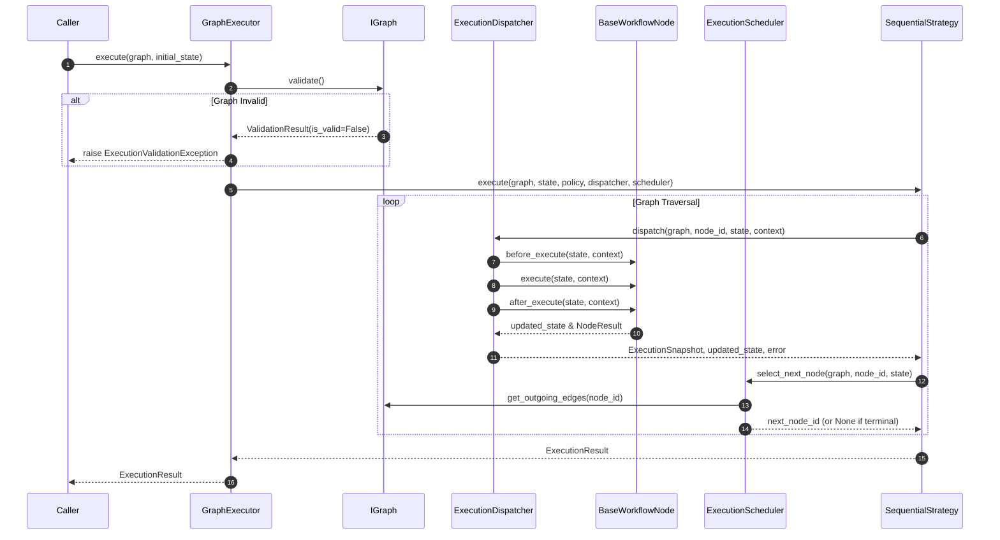

# 026: Graph Execution Engine Architecture

## Purpose

The **Graph Execution Engine** provides a framework-independent, provider-agnostic runtime for traversing compiled `Graph` workflows (Phase 6.2) and executing `BaseWorkflowNode` instances (Phase 6.3). It evaluates edge predicates, manages state transitions immutably via `ConversationState`, captures `ExecutionSnapshot` history, enforces `ExecutionPolicy` constraints, computes `ExecutionMetrics`, and emits telemetry events.

---

## Core Pipeline Architecture

```
                                  +-------------------+
                                  |   Graph Object    |
                                  +---------+---------+
                                            |
                                  +---------v---------+
                                  | Pre-Validation    |  --> Validates Graph structure
                                  +---------+---------+
                                            |
                                  +---------v---------+
                                  | ExecutionPlanner  |  --> Formulates plan
                                  +---------+---------+
                                            |
                                  +---------v---------+
                                  | ExecutionStrategy |  --> Traversal Loop (e.g. SequentialStrategy)
                                  +----+----+----+----+
                                       |    |    |
        +------------------------------+    |    +------------------------------+
        |                                   |                                   |
+-------v-------+                   +-------v-------+                   +-------v-------+
|  Dispatcher   |                   |   Scheduler   |                   | Snapshot Engine|
+-------+-------+                   +-------+-------+                   +-------+-------+
        |                                   |                                   |
        v                                   v                                   v
Node Lifecycle Invocations         Edge Predicate Evaluation           Snapshot Telemetry
(before -> execute -> after)       (priority, branching, depth)        (state, NodeResult)
```

---

## Sequence Diagram (Mermaid)



---

## Architectural Rules

> [!IMPORTANT]
> **Mandatory Graph Validation Rule**: Every execution MUST begin by invoking `graph.validate()`. If structural errors exist or validation fails, execution is halted immediately prior to running any node.

> [!WARNING]
> **Immutable State & Side-Effect Freedom**: Node execution never mutates prior state instances. Execution strategies pass updated state snapshots forward. Side effects (DB, APIs, payments) are strictly forbidden within the engine core.

> [!NOTE]
> **Explicit Depth Protection**: The engine enforces `policy.max_depth` (default: 50 steps) during traversal. If graph depth exceeds `max_depth`, an `ExecutionValidationException` is raised to prevent infinite traversal loops.

---

## Telemetry Events

The engine emits telemetry event objects (`WorkflowEvent`) during traversal:
- `WORKFLOW_STARTED`: Triggered when graph traversal begins.
- `WORKFLOW_COMPLETED`: Triggered on successful graph completion.
- `WORKFLOW_FAILED`: Triggered on execution failure.

---

## Non-Goals & Future Integration

### Non-Goals (Phase 6.4)
- Provider LLM SDK integration (OpenAI, Gemini, Claude, Ollama).
- External REST API calls, database writes, or Redis persistence.
- Streaming event handlers or WebSockets.
- LangGraph integration.
- Human-in-the-loop approvals.

### Future Integration Points (Phase 6.5+)
- **Streaming & Persistence Engine**: Will consume `ExecutionSnapshot` history and `ExecutionResult` to stream tokens and persist checkpoints.
