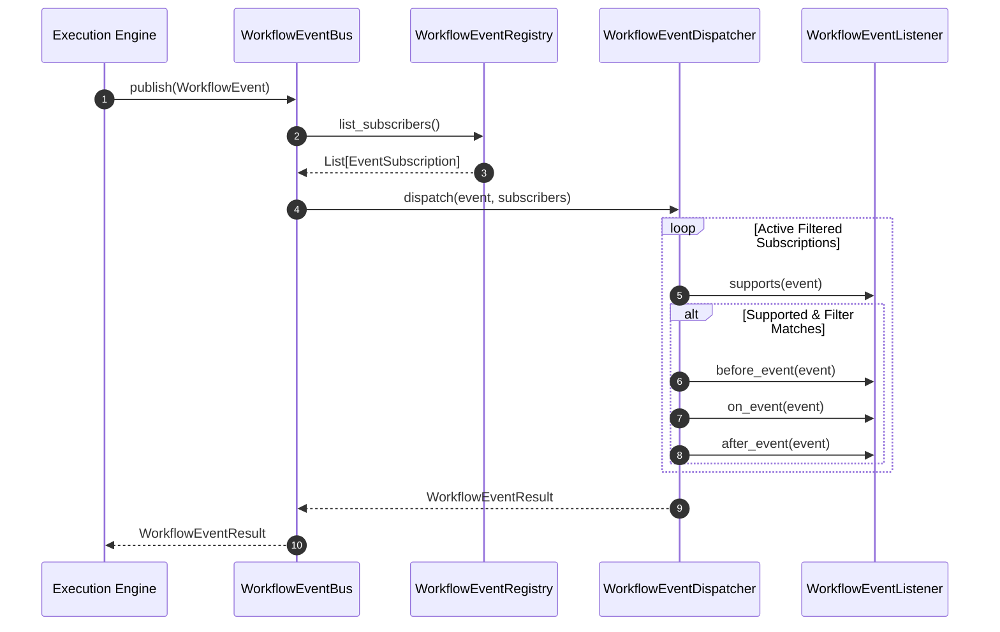

# 028: Workflow Event & Observability Foundation Architecture

## Purpose

The **Workflow Event & Observability Foundation** provides a provider-independent, framework-agnostic event infrastructure for graph workflow execution. It decouples event producers (e.g. Graph Execution Engine) from event consumers (telemetry, loggers, metrics aggregators) via an in-memory event bus and observer-only listener model.

---

## Event Invariants

- **Immutable Events**: Workflow events cannot be modified after creation.
- **Observational Only**: Events are read-only telemetry snapshots.
- **At-Most-Once Delivery**: Event Bus guarantees at-most-once in-memory delivery.
- **State Protection**: Listeners never modify `ConversationState`.
- **Error Isolation**: Dispatcher isolates listener failures so an exception in one listener does not affect others.
- **Control Independence**: Event publication never alters graph execution flow.

---

## Event Flow

```
Graph Executor
      │
      ▼
WorkflowEvent
      │
      ▼
WorkflowEventBus
      │
      ▼
WorkflowEventDispatcher
      │
      ▼
WorkflowEventRegistry
      │
      ▼
WorkflowEventListener(s)
```

---

## Event Ownership & Responsibilities

```
+---------------------+       Publishes       +--------------------+
|  Execution Engine   | --------------------> | WorkflowEventBus   |
+---------------------+                       +---------+----------+
                                                        |
                                                  Routes|
                                                        v
                                              +--------------------+
                                              | WorkflowEvent-     |
                                              |    Dispatcher      |
                                              +---------+----------+
                                                        |
                                              Dispatches| (Priority & Filtering)
                                                        v
                                              +--------------------+
                                              | WorkflowEvent-     |
                                              |     Listener       |  (Read-only Observer)
                                              +--------------------+
```

1. **Execution Engine**: Publishes immutable `WorkflowEvent` objects.
2. **Event Bus**: Routes events to matching subscribers.
3. **Dispatcher**: Dispatches events to listeners with priority ordering, filtering, and error isolation.
4. **Listeners**: Read-only observers that react to events. Listeners MUST NEVER modify execution flow or mutate `ConversationState`.

---

## Delivery Guarantee Invariant

> [!IMPORTANT]
> **Delivery Invariant**: The `WorkflowEventBus` guarantees **at-most-once in-memory delivery**. It does NOT provide persistence, retries, acknowledgements, ordering across processes, or durability.

---

## Sequence Diagram (Mermaid)



---

## Architectural Models

- **`WorkflowEvent`**: Immutable event domain object containing `event_id`, `event_type`, `category`, `timestamp`, `execution_id`, `node_id`, `status`, `payload`, `metadata`.
- **`EventEnvelope`**: Transport wrapper separating delivery headers from event domain objects.
- **`EventSubscription`**: Binds a `WorkflowEventListener` to a `WorkflowEventFilter` and `EventPriority`.
- **`WorkflowEventFilter`**: Multi-dimensional predicate filter (category, type, status, IDs, priority, tags, time bounds).
- **`WorkflowEventSerializer`**: Abstract serialization layer (`JSONEventSerializer`, `MessagePackEventSerializer`, `ProtobufEventSerializer`).

---

## Non-Goals & Future Integration Roadmap

### Non-Goals (Phase 6.5)
- WebSockets, SSE, or streaming transports.
- External brokers (Kafka, RabbitMQ, Redis Streams).
- Monitoring exporters (OpenTelemetry, Prometheus, Grafana).
- Event persistence or event-sourcing replay.

### Future Integration Roadmap
- **Phase 6.6 — Checkpoint & Replay Foundation**: Session checkpointing, state snapshot persistence, and replay listeners.
- **Phase 6.7 — Streaming & Real-Time Foundation**: WebSockets, SSE, and real-time streaming listeners.
- **Phase 6.8 — Human-in-the-Loop Foundation**: Human approval interrupts and execution resume handlers.
