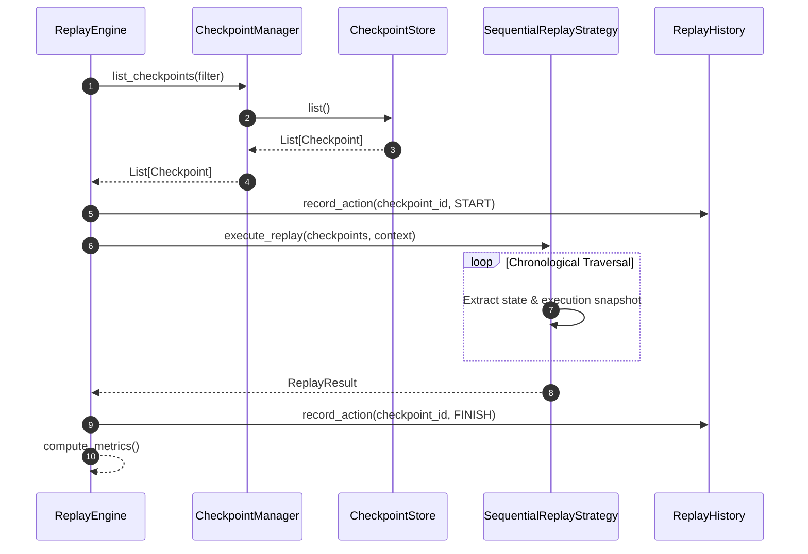

# 030: Checkpoint & Replay Foundation Architecture

## Purpose

The **Checkpoint & Replay Foundation** provides a provider-independent, framework-agnostic runtime infrastructure for capturing immutable session execution state snapshots, executing state recovery, simulating workflow step progression, and managing replay audit history without mutating original state lineage or relying on third-party persistence backends.

---

## Checkpoint Ownership & Responsibilities

```
+------------------------+       Creates       +-----------------------+
| Graph Execution Engine | ------------------> |  CheckpointManager    |
+------------------------+                     +-----------+-----------+
                                                           |
                                                  Persists | (In-Memory)
                                                           v
                                               +-----------------------+
                                               | InMemoryCheckpoint-   |
                                               |        Store          |
                                               +-----------+-----------+
                                                           |
                                                  Consumes | (Read-Only)
                                                           v
                                               +-----------------------+
                                               |     ReplayEngine      |
                                               +-----------------------+
```

1. **Graph Execution Engine**: Creates execution state snapshots.
2. **Checkpoint Manager**: Manages creation, restoration, archiving, validation, and retention policies.
3. **Checkpoint Store**: Persists checkpoints in-memory (`InMemoryCheckpointStore`). Stores NEVER mutate stored checkpoints.
4. **Replay Engine**: Consumes checkpoints for replay, resume, restart, and simulation operations.

---

## Replay & Checkpoint Invariants

> [!IMPORTANT]
> **Immutability & Lineage Rules**:
> - **Immutable Checkpoints**: Checkpoint records cannot be overwritten or mutated once stored.
> - **History Preservation**: Replay never overwrites past execution history.
> - **Lineage Protection**: Replay always produces a new execution state lineage.
> - **Version Match**: Replay uses compatible schema and state versions only.
> - **Corruption Protection**: A failed replay run NEVER corrupts existing stored checkpoints.

---

## Checkpoint & Replay Lifecycle Diagram

```
ConversationState
      │
      ▼
  Checkpoint
      │
      ▼
Checkpoint Store
      │
      ▼
 Replay Engine
      │
      ▼
New ConversationState
```

### Sequence Diagram (Mermaid)



---

## Architectural Models

- **`Checkpoint`**: Immutable snapshot containing `checkpoint_id`, `execution_id`, `workflow_id`, `state_snapshot`, `execution_snapshot`, `status`, and `metadata`.
- **`CheckpointVersion`**: Dedicated version container (`checkpoint_version`, `schema_version`, `state_version`, `execution_version`, `graph_version`).
- **`CheckpointValidationResult`**: Detailed validation container (`is_valid`, `warnings`, `errors`, `version_match`, `integrity_passed`, `compatible`).
- **`ReplayContext` & `ReplayMode`**: `ReplayMode` enum (`FULL`, `STEP`, `RESUME`, `SIMULATION`, `DEBUG`).
- **`ReplayHistory` & `ReplayAction`**: `ReplayAction` enum (`START`, `STEP_FORWARD`, `STEP_BACKWARD`, `RESUME`, `RESTART`, `FINISH`, `CANCEL`).

---

## Non-Goals & Future Integration

### Non-Goals (Phase 6.6)
- External storage integrations (Redis, PostgreSQL, SQLAlchemy).
- Compression or encryption algorithms.
- Vector DB state persistence.
- WebSockets or SSE streaming integrations.

### Future Integration Roadmap
- **Phase 6.7 — Streaming & Real-Time Foundation**: WebSockets / SSE streaming adapters subscribing to checkpoint & replay events.
- **Phase 6.8 — Human-in-the-Loop Foundation**: Approval interrupt checkpoints and resume operations.
