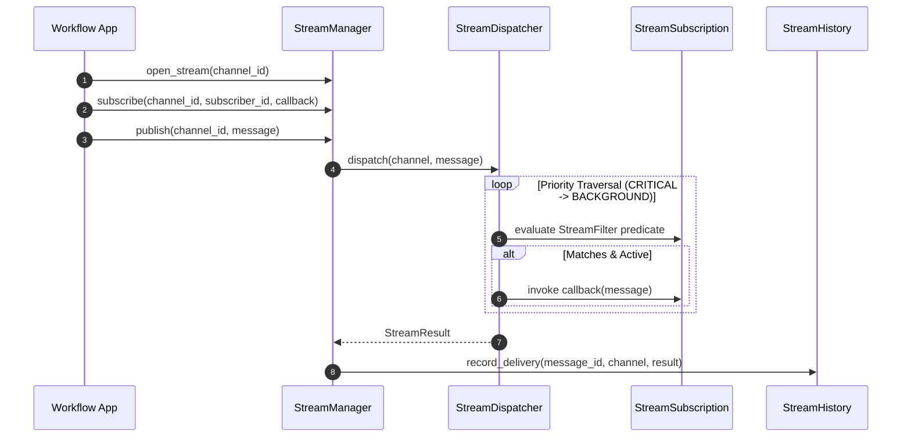

# 032: Streaming & Real-Time Foundation Architecture

## Purpose

The **Streaming & Real-Time Foundation** provides a framework-independent, transport-agnostic real-time message streaming infrastructure on top of the Workflow Event Foundation (Phase 6.5) and Checkpoint Foundation (Phase 6.6). It introduces reusable streaming contracts, priority-ordered dispatching, channel subscriptions, and backpressure/heartbeat models without relying on third-party transport frameworks (FastAPI WebSockets, SSE, Redis PubSub, Kafka, or RabbitMQ).

---

## Ownership Model

```
+------------------------+       Emits       +-----------------------+
| Graph Execution Engine | ----------------> |    Workflow Events    |
+------------------------+                   +-----------+-----------+
                                                         |
                                                Consumes | (Observer)
                                                         v
                                             +-----------------------+
                                             |    StreamManager      |
                                             +-----------+-----------+
                                                         |
                                                Routes   | (Priority)
                                                         v
                                             +-----------------------+
                                             |   StreamDispatcher    |
                                             +-----------+-----------+
                                                         |
                                                Forwards | (Transport)
                                                         v
                                             +-----------------------+
                                             |    StreamAdapter      |
                                             +-----------+-----------+
                                                         |
                                                Delivers | (Future)
                                                         v
                                             +-----------------------+
                                             |  External Transports  |
                                             +-----------------------+
```

---

## Streaming Invariants

> [!IMPORTANT]
> **Architectural Rules**:
> - **Immutable Messages**: `StreamMessage` objects are strictly frozen (`frozen=True`) and immutable upon creation.
> - **State Isolation**: Real-time streaming NEVER modifies `ConversationState` or graph execution flow.
> - **Logic Separation**: Adapters strictly perform transport delivery and NEVER execute business logic.
> - **Failure Isolation**: Dispatcher isolates subscriber exceptions so a failing subscriber callback never breaks other listeners or halts execution.
> - **Transport Independence**: `StreamMessage` and `StreamEnvelope` exist independently of transport protocol details.
> - **Non-Blocking Delivery**: Stream publication operates asynchronously and does not block graph step traversal.

---

## Delivery Guarantees & Capabilities

- **Delivery Guarantee**: Enum `DeliveryGuarantee` (`AT_MOST_ONCE`, `AT_LEAST_ONCE`, `BEST_EFFORT`). The in-memory `StreamManager` guarantees `AT_MOST_ONCE` delivery.
- **Adapter Capabilities**: Declared via `AdapterCapabilities` (`supports_binary`, `supports_batch`, `supports_heartbeat`, `supports_backpressure`, `supports_compression`, `supports_replay`).
- **Backpressure**: Managed via `BackpressurePolicy` and `OverflowStrategy` (`DROP_OLDEST`, `DROP_NEWEST`, `BLOCK`, `FAIL`).

---

## Streaming Lifecycle (Mermaid)



---

## Non-Goals & Explicit Future Integration Roadmap

### Non-Goals (Phase 6.7)
- FastAPI WebSockets / Starlette WebSocket implementations.
- Server-Sent Events (SSE) routers.
- Redis PubSub, Kafka, RabbitMQ, Socket.IO, gRPC drivers.
- OpenTelemetry / Prometheus exporters.

### Future Integration Roadmap
- **Phase 6.8 — Human-in-the-Loop Foundation**: Human approval interrupt streams and governance notification handlers.
- **Phase 7 — Enterprise Messaging Runtime**:
  - WebSocket Transport Adapter
  - SSE Transport Adapter
  - CLI & Terminal Stream Adapters
  - Token-level Response Stream Adapters
- **Phase 8 — Voice Platform**:
  - gRPC Audio & Real-Time Voice Streaming Adapters
  - Low-Latency Telemetry & Audio Exporters
