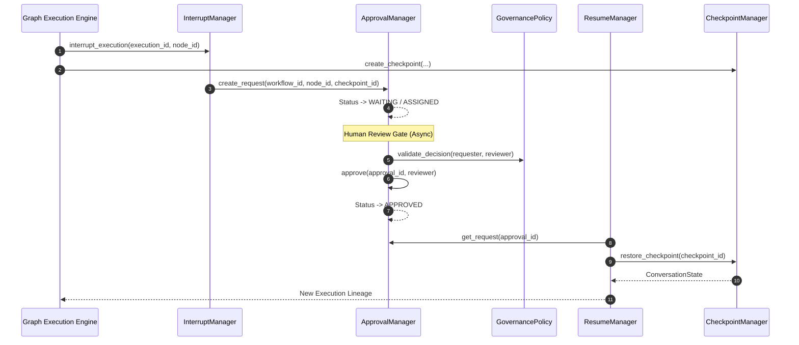

# 034: Human-in-the-Loop (HITL) Foundation Architecture

## Purpose

The **Human-in-the-Loop (HITL) Foundation** provides a provider-independent, framework-agnostic architecture for defining immutable human approval contracts, execution interruption gates, resume mechanisms, and governance policies on top of the Streaming (Phase 6.7), Checkpoint (Phase 6.6), Event (Phase 6.5), and Graph Execution (Phase 6.4) foundations.

---

## Approval State Machine Diagram

```
CREATED
   │
   ▼
ASSIGNED
   │
   ▼
WAITING
 ┌─┴───────────────┐
 ▼                 ▼
APPROVED      REJECTED
 │                 │
 ▼                 ▼
COMPLETED     COMPLETED

       or

WAITING
   │
   ▼
ESCALATED
```

### Sequence Diagram (Mermaid)



---

## Explicit HITL Invariants

> [!IMPORTANT]
> **Architectural Invariants**:
> - **Immutable Approval Contracts**: `ApprovalRequest` objects are strictly frozen (`frozen=True`) read-only models.
> - **State Preservation**: Approval operations NEVER mutate `ConversationState` instances.
> - **Lineage Protection**: Execution resume operations ALWAYS create a new execution state lineage.
> - **Duty Separation**: Only `ResumeManager` resumes execution from approvals/checkpoints. `ApprovalManager` NEVER executes workflow nodes.
> - **Pure Contracts**: `GovernancePolicy` rules define reusable evaluation contracts and NEVER perform business logic or external side effects.

---

## Integration Architecture

1. **Conversation State Integration**: HITL contracts preserve `ConversationState` immutability and interact via state snapshots.
2. **Graph Execution Integration**: `InterruptManager` defines execution pause and interrupt signaling contracts without embedding engine runners.
3. **Workflow Event Integration**: Exposes `ApprovalEvent` DTO placeholders for event observers.
4. **Checkpoint Integration**: `ResumeManager` integrates with `CheckpointManager.restore_checkpoint()` to restart or resume execution.
5. **Streaming Integration**: Exposes approval status updates as stream message payloads.

---

## Production Readiness Checklist

- [x] **Provider Independent**: Zero coupling to AI provider SDKs (OpenAI, Claude, Gemini, Ollama).
- [x] **Framework Independent**: Zero imports from FastAPI, Starlette, WebSockets, or UI frameworks.
- [x] **Stateless**: Pure contract structures with configurable storage managers.
- [x] **Async Compatible**: Non-blocking async API surface.
- [x] **Immutable Models**: Frozen Pydantic domain models.
- [x] **Zero Business Logic**: Reusable DTOs and lifecycle contracts only.
- [x] **Clean Architecture**: Domain model, contracts, and manager layer separation.
- [x] **SOLID Principles**: Single responsibility interfaces and open/closed extension registries.
- [x] **Test Coverage**: 100% test coverage across all HITL components.
- [x] **Import Isolation**: Verified zero framework leakage via automated import testing.

---

## Non-Goals (Phase 6.8)

- UI approval dashboards or WebSockets integrations.
- Email, Slack, Teams, or SMS notification handlers.
- Database persistence or Redis state stores.
- Third-party orchestration frameworks (LangGraph, CrewAI, AutoGen, Semantic Kernel).
