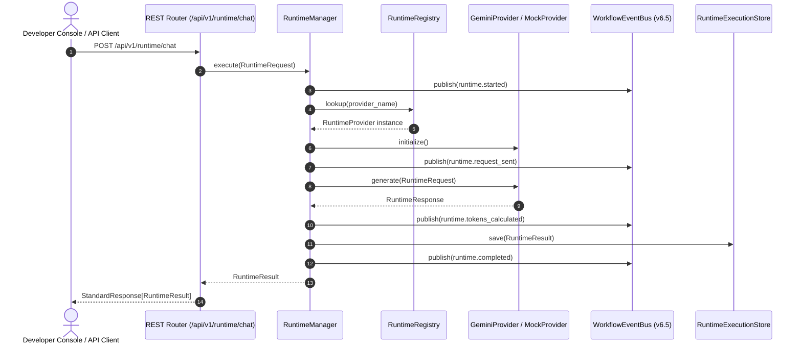

# ADR 036: Enterprise LLM Runtime Engine Architecture

## Status
Accepted

## Date
2026-08-07

## Context
Following the completion of the 15 locked Foundation Architecture tiers (v1.0 – v6.8.1), Phase 7 initiates the **Enterprise Messaging Runtime**. The messaging platform requires a provider-independent execution engine capable of orchestrating LLM request generation, token accounting, retries with backoff, latency measurement, observability event dispatching, and health checking across multiple AI models without hardcoding provider-specific logic into core business services.

## Decision
We establish the **Enterprise LLM Runtime Engine** under package `backend/app/runtime/`.

### Key Architectural Components
1. **`RuntimeProvider` ABC**: Abstract contract defining `initialize()`, `generate()`, `generate_stream()`, `count_tokens()`, `get_capabilities()`, and `health_check()`.
2. **`RuntimeManager`**: Central orchestration engine managing validation middleware, provider selection, timeout enforcement, retries, event bus notification dispatch (`WorkflowEventBus`), and store persistence.
3. **`RuntimeRegistry` & `RuntimeFactory`**: Thread-safe registry supporting instance registration, lazy factory loading, lookup, and provider construction.
4. **`ModelRegistry`**: Metadata registry managing `ModelInfo` definitions (context windows, input/output token pricing).
5. **`RuntimeContext`, `RuntimeMetrics`, `RuntimeResult`**: Immutable execution context, telemetry metrics, and unified result containers mirroring Phase 6 foundation result objects.
6. **`GeminiProvider`**: Production provider utilizing official Google GenAI SDK (`google.genai`) for `gemini-2.5-flash` and `gemini-2.5-pro`.
7. **`MockProvider`**: Deterministic provider for offline unit testing, CI pipelines, and demonstration mode.

## Execution Sequence

## Consequences
- **Provider Independence**: New LLM providers (OpenAI, Anthropic, Ollama, Bedrock) plug directly into `RuntimeRegistry` without changing business services or REST endpoints.
- **Observability**: Granular execution events (`runtime.started`, `runtime.prompt_prepared`, `runtime.provider_selected`, `runtime.tokens_calculated`, `runtime.completed`) integrate seamlessly with the Phase 6.5 `WorkflowEventBus`.
- **Zero Foundation Modification**: Foundations v1.0 through v6.8.1 remain 100% frozen and untouched.
