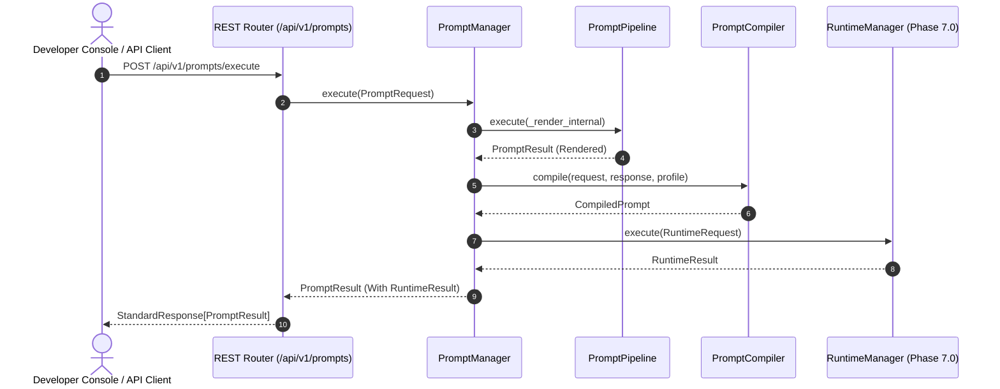

# ADR 038: Prompt Execution Engine Architecture

## Status
Accepted

## Date
2026-08-07

## Context
Following the completion of the Enterprise LLM Runtime Engine (Phase 7.0), Phase 7.1 establishes the **Prompt Execution Engine**. The messaging platform requires a provider-independent, framework-independent prompt composition, templating, rendering, validation, linting, optimization, and lifecycle management layer situated above the Runtime Engine.

## Decision
We establish the **Prompt Execution Engine** under package `backend/app/prompt/`.

### Key Architectural Decisions
1. **Decoupled Architecture (Render vs. Execute)**:
   - `PromptManager.render()` renders, validates, lints, and optimizes prompts returning a pure `PromptResult` without LLM inference.
   - `PromptManager.execute()` renders the prompt and then compiles it via `PromptCompiler` before passing it to `RuntimeManager.execute()`.
2. **`PromptProfile` Separation**:
   - Templates define *what to say*; `PromptProfile` objects define *how to generate* (model, temperature, max tokens, response format).
3. **`PromptCompiler` Layer**:
   - Converts `PromptResponse` and `PromptProfile` into `CompiledPrompt` format required by `RuntimeManager`.
4. **`processors/` Package**:
   - Houses `PromptRenderer`, `PromptValidator`, `PromptOptimizer`, and `PromptLinter`.
5. **Configurable `PromptPipeline`**:
   - Extensible middleware chain (`ValidationMiddleware`, `SecurityMiddleware`, `VariableInjectionMiddleware`, `RenderingMiddleware`, `OptimizationMiddleware`, `AuditMiddleware`).
6. **Observability Event Dispatch**:
   - Emits granular events (`prompt.created`, `prompt.validated`, `prompt.rendered`, `prompt.optimized`, `prompt.executed`, `prompt.failed`) to `WorkflowEventBus`.

## Execution Sequence

## Consequences
- **Decoupled Inference**: Prompts can be rendered, tested, linted, and previewed independently of LLM API calls.
- **Provider Independence**: Prompts are composed in standard `ChatMessage` primitives with zero SDK dependencies.
- **Zero Foundation Modification**: Foundations v1.0 through v7.0 remain 100% frozen and untouched.
