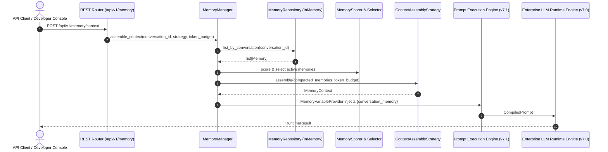

# ADR 040: Enterprise Memory Runtime Architecture

## Status
Accepted

## Date
2026-08-07

## Context
Following the completion of the Enterprise LLM Runtime Engine (Phase 7.0) and Prompt Execution Engine (Phase 7.1), Phase 7.2 establishes the **Enterprise Memory Runtime**. The platform requires provider-independent, framework-independent conversation memory orchestration, lifecycle management, retrieval scoring, context assembly, and token budget management situated directly below the Prompt Engine and above the Runtime Engine.

## Decision
We establish the **Enterprise Memory Runtime** under package `backend/app/memory/`.

### Key Architectural Decisions
1. **Provider & Storage Independence**:
   - Zero Pinecone, ChromaDB, FAISS, Weaviate, Qdrant, Redis, SQL, MongoDB, LangChain, or LlamaIndex SDK code inside Memory Runtime core.
   - Reference storage implementation uses `InMemoryMemoryRepository` managed by `MemoryRegistry` and `MemoryFactory`.
2. **No Embedding Operations**:
   - Memory Runtime operates on text, structured metadata, scoring algorithms, and token budget allocation. Embeddings belong strictly to Phase 7.6 (RAG Engine).
3. **Explicit Memory Lifecycle**:
   - `MemoryLifecycleManager` enforces formal lifecycle state transitions (`CREATED` ➔ `ACTIVE` ➔ `PINNED` ➔ `ARCHIVED` ➔ `EXPIRED` ➔ `DELETED`).
4. **Workflow Event Integration (v6.5)**:
   - Memory events (`memory.created`, `memory.updated`, `memory.pinned`, `memory.archived`, `memory.expired`, `memory.deleted`, `memory.context_built`) publish directly to Phase 6.5's `WorkflowEventBus`.
5. **Prompt Engine Integration**:
   - Implements `MemoryVariableProvider` extending Phase 7.1's `VariableProvider` ABC, dynamically resolving `{conversation_memory}` variables for `PromptManager`.
6. **Strategy-Driven Context Assembly**:
   - `ContextAssemblyStrategy` ABC with concrete strategies: `RecentStrategy`, `ImportanceStrategy`, `HybridStrategy`, `SlidingWindowStrategy`.

## Execution Sequence & Flow

---

## Future Compatibility Matrix

This table documents the intended extension points and compatibility across future release phases:

| Future Phase / System | Integration Point | Status | Compatibility |
| :--- | :--- | :---: | :---: |
| **Enterprise LLM Runtime Engine (v7.0)** | Executes compiled prompts containing assembled memory variables | Completed | ✅ Compatible |
| **Prompt Execution Engine (v7.1)** | Consumes `MemoryVariableProvider` to inject `{conversation_memory}` | Completed | ✅ Compatible |
| **Tool Runtime (v7.3)** | Tool execution results stored as `MemoryType.WORKING` | Planned | ✅ Compatible |
| **Graph Runtime Integration (v7.4)** | Graph nodes read/write state memories via `MemoryManager` | Planned | ✅ Compatible |
| **Multi-Agent Runtime (v7.5)** | Agent communication logged as `MemoryType.SESSION` & `EPISODIC` | Planned | ✅ Compatible |
| **RAG Engine (v7.6)** | Vector store adapters plug into `MemoryRepository` ABC with embeddings | Planned | ✅ Compatible |
| **Voice Platform Expansion (Phase 8)** | Voice transcript turns recorded as short-term memory streams | Planned | ✅ Compatible |

---

## Consequences
- **Zero Provider Lock-In**: Memory management is completely isolated from database/vector vendors.
- **Deterministic Context Assembly**: Token window budget is strictly enforced without unexpected context truncation.
- **Zero Refactoring Required**: Future phases plug into `MemoryRepository` ABC, `VariableProvider`, and `ContextAssemblyStrategy` without modifying core memory logic.
