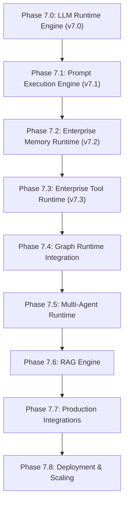

# ADR 042: Enterprise Tool Runtime Architecture

## Status
Accepted

## Date
2026-08-07

## Context
Following the completion of the Enterprise LLM Runtime Engine (Phase 7.0), Prompt Execution Engine (Phase 7.1), and Enterprise Memory Runtime (Phase 7.2), Phase 7.3 establishes the **Enterprise Tool Runtime**. The platform requires provider-independent, framework-independent, secure tool registration, JSON schema discovery, authorization, execution, pipeline processing, chaining, and telemetry.

## Decision
We establish the **Enterprise Tool Runtime** under package `backend/app/tools/`.

### Key Architectural Decisions
1. **Provider & Framework Independence**:
   - Zero LangChain Tools, LangGraph, CrewAI, AutoGen, OpenAI Function Calling, Gemini Function Calling, Anthropic Tool Use, MCP Runtime, Zapier, or Composio SDK code inside Tool Runtime core.
2. **No External Service Dependencies**:
   - Reference tool implementations are 100% in-memory utilities (`EchoTool`, `CalculatorTool`, `DatetimeTool`, `UUIDTool`). External APIs belong strictly to Phase 7.7 (Production Integrations).
3. **Structured Schemas & Manifests**:
   - Every tool specifies a `ToolSchema` (JSON Schema for parameters and outputs) packaged inside a `ToolManifest` with capabilities and deprecation metadata (`deprecated`, `replacement_tool`).
4. **Tool Discovery Service**:
   - `ToolDiscoveryService` enables dynamic tool search and filtering by category (`MATH`, `TIME`, `TEXT`, `UTILITY`), permission, and capability (`supports_async`, `supports_batch`).
5. **ToolPipeline & ToolChain**:
   - `ToolPipeline` enforces step-by-step processing: `Validation` ➔ `Permission` ➔ `Policy` ➔ `Execution` ➔ `Analytics` ➔ `Events`.
   - `ToolChain` orchestrates sequential multi-step tool execution.

---

## Full Runtime Stack Connection Flow

---

## Consequences
- **Zero Provider Lock-In**: Tool definition and execution are completely decoupled from AI provider SDKs.
- **Deterministic Pipeline Execution**: Tool permissions and execution policies (timeouts, concurrency) are strictly enforced before invocation.
- **Zero Refactoring Required**: Future phases plug into `BaseTool`, `ToolSchema`, `ToolManifest`, `ToolPipeline`, and `ToolDiscoveryService` without mutating existing runtime layers.
