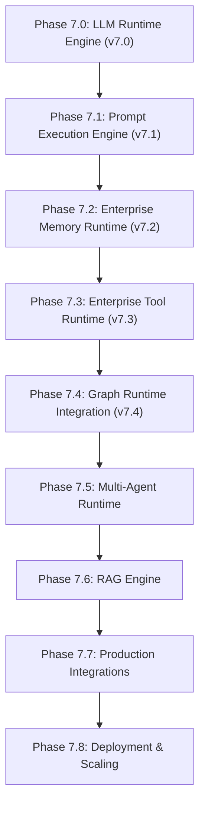

# ADR 044: Enterprise Graph Runtime Architecture

## Status
Accepted

## Date
2026-08-07

## Context
Following Phase 7.0 (LLM Runtime), Phase 7.1 (Prompt Engine), Phase 7.2 (Memory Runtime), and Phase 7.3 (Tool Runtime), Phase 7.4 establishes the **Enterprise Graph Runtime**. The platform requires a provider-independent, framework-independent graph execution orchestration layer that coordinates state machines, DAG plans, cursor navigation, scheduling, middleware pipelines, checkpoints, streaming, and HITL governance without modifying previously frozen runtime packages.

## Decision
We establish the **Enterprise Graph Runtime** under package `backend/app/graph_runtime/`.

### Key Architectural Decisions
1. **Decoupled Orchestration**:
   - Graph Runtime does NOT redefine graph structures; it consumes Phase 6 `StateGraph` definitions and workflow nodes.
2. **Provider & Vendor Independence**:
   - Zero vendor API SDK calls inside Graph Runtime. All AI execution delegates to `RuntimeManager`, `PromptManager`, `MemoryManager`, `ToolManager`, `CheckpointManager`, `ApprovalManager`, `StreamManager`, and `WorkflowEventBus`.
3. **Planning & Execution Separation**:
   - `GraphPlanner` produces `GraphExecutionPlan` DAG models which are scheduled by `GraphScheduler` and executed by `GraphRuntimeExecutor`.
4. **Middleware Pipeline**:
   - Execution passes through `GraphRuntimePipeline` (`Validation` ➔ `Authorization` ➔ `Memory Injection` ➔ `Tool Resolution` ➔ `Prompt Rendering` ➔ `Runtime Execution` ➔ `Checkpoint` ➔ `Streaming` ➔ `Events`).
5. **Reserved Extension Model**:
   - Reserved `extensions/` directory for future custom schedulers, planners, and middleware.

---

## Full Runtime Stack Connection Flow

---

## Consequences
- **Zero Provider Lock-In**: Decoupled graph orchestration cleanly separates execution flow from AI providers.
- **State Replayability**: `NodeExecutionContext` and `ExecutionTrace` enable exact state replay and debugging.
- **Zero Refactoring Required**: Future phases plug into `GraphExecutionPlan` and `GraphRuntimeManager` without mutating existing runtime layers.
