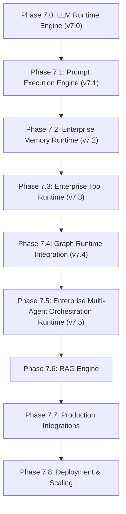

# ADR 046: Enterprise Multi-Agent Orchestration Runtime Architecture

## Status
Accepted

## Date
2026-08-07

## Context
Following Phase 7.4 (Graph Runtime Integration), Phase 7.5 establishes the **Enterprise Multi-Agent Orchestration Runtime** under package `backend/app/agents/`. The platform requires a provider-independent, framework-independent multi-agent orchestration layer that coordinates autonomous AI worker agents, supervisor agents, planner agents, team composition, task queues, mailbox messaging, and delegation depth without modifying previously frozen runtime packages (`app/runtime/`, `app/prompt/`, `app/memory/`, `app/tools/`, `app/graph_runtime/`).

## Decision
We establish the **Enterprise Multi-Agent Orchestration Runtime** under package `backend/app/agents/`.

### Key Architectural Decisions
1. **Decoupled Agent Orchestration**:
   - `AgentRuntimeManager` is the single central orchestration entry point. Lower runtime layers are consumed strictly via public manager interfaces (`GraphRuntimeManager`, `ToolManager`, `MemoryManager`, `PromptManager`, `RuntimeManager`, `WorkflowEventBus`).
2. **Separation of Agent Definition and Agent Instance**:
   - `AgentDefinition` captures blueprint specifications (identity, role, persona, capabilities, default policy, budget, permissions).
   - `AgentInstance` captures active worker pod state (instance ID, definition ID, active task, lifecycle state, local context).
3. **Event-Driven Inter-Agent Communication**:
   - `AgentMessage` and `AgentMailbox` managed via `CommunicationManager` publishing event notifications directly to `WorkflowEventBus` (v6.5).
4. **Task System & Delegation**:
   - `AgentTask`, `TaskQueue`, `TaskScheduler`, and `DelegationManager` supporting priority queuing, sub-task delegation, delegation depth limits, and budget enforcement.
5. **Team Composition**:
   - `AgentTeam`, `TeamRegistry`, and `TeamManager` supporting multi-agent team execution topologies (`SupervisorAgent` ➔ `PlannerAgent` / `ResearchAgent` / `ToolAgent` / `ReviewerAgent`).

---

## Full Runtime Stack Topology

---

## Consequences
- **Zero Framework Coupling**: Eliminates dependency on external multi-agent SDKs (AutoGen, CrewAI, LangGraph).
- **Scalable Worker Pods**: `AgentDefinition` vs `AgentInstance` enables spawning multiple worker pods of the same blueprint type.
- **Robust Delegation Safety**: Delegation depth limits and budget checks prevent infinite delegation loops.
