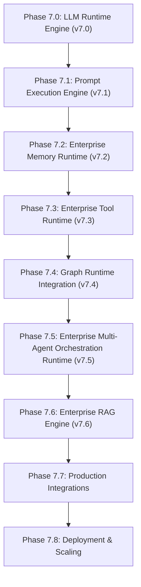

# ADR 048: Enterprise RAG Engine Architecture

## Status
Accepted

## Date
2026-08-07

## Context
Following Phase 7.5 (Enterprise Multi-Agent Orchestration Runtime), Phase 7.6 establishes the **Enterprise RAG Engine** under package `backend/app/rag/`. The platform requires a provider-independent, storage-independent Retrieval-Augmented Generation engine that coordinates document ingestion, parsing, chunking, embedding, vector indexing, retrieval planning, pluggable reranking, citation generation, and context assembly without modifying core runtime packages (`app/runtime/`, `app/prompt/`, `app/memory/`, `app/tools/`, `app/graph_runtime/`, `app/agents/`).

## Decision
We establish the **Enterprise RAG Engine** under package `backend/app/rag/`.

### Key Architectural Decisions
1. **Separation of Ingestion Runtime and Query Runtime**:
   - `IngestionRuntime` (`ingestion_runtime.py`): Parse ➔ Chunk ➔ Embed ➔ Index.
   - `QueryRuntime` (`query_runtime.py`): Rewrite ➔ Plan ➔ Retrieve ➔ Rerank ➔ Context ➔ Citations.
2. **Provider & Storage Independence**:
   - Abstract interfaces (`EmbeddingProvider`, `VectorRepository`, `BaseDocumentParser`, `CacheProvider`) with in-memory reference implementations. External vendor drivers belong in reserved package directories (`backend/app/rag/providers/`, `parsers/`, `extensions/`).
3. **Retrieval Planning & Pluggable Reranking**:
   - `RetrievalPlanner` generates `RetrievalPlan`. `BaseReranker` provides pluggable strategy implementations (`CosineReranker`, `HybridReranker`, `MetadataReranker`, `WeightedReranker`, `CrossEncoderReranker`).
4. **Decoupled Chunk & Embedding Models**:
   - `Chunk` (un-embedded text block) separated from `EmbeddedChunk` (vector binding).
5. **No Direct LLM Calls**:
   - `RAGManager` delegates all conversational generation to `PromptManager` (v7.1) and `RuntimeManager` (v7.0) via public interfaces.

---

## Full Runtime Stack Topology

---

## Consequences
- **Zero Framework Lock-in**: Easy swapping of embedding models, vector stores, and parsers without refactoring core code.
- **Auditability**: `Citation` engine and `RetrievalExplanation` provide exact traceability for enterprise audit compliance.
- **Resource Control**: `RetrievalBudget` enforces token and chunk bounds.
