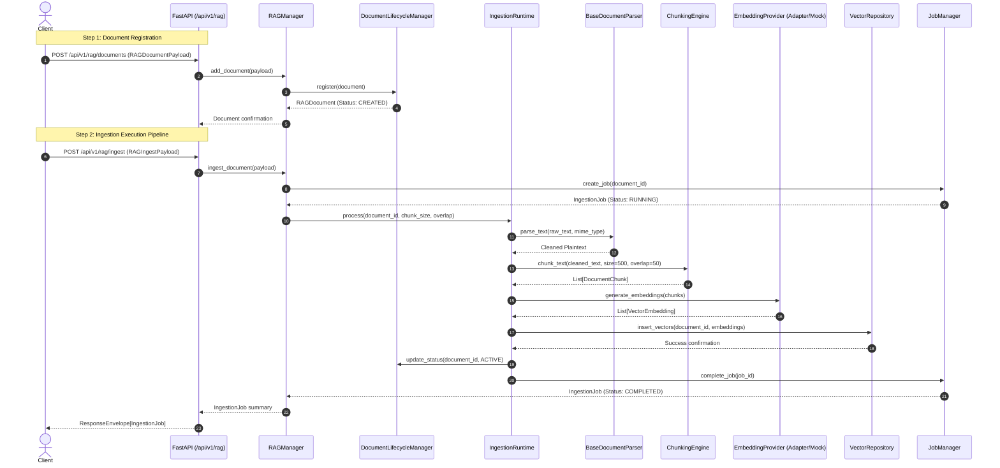

# End-to-End Walkthrough: Document Ingestion Pipeline

This document provides a source-verified trace of how knowledge documents are registered, parsed, chunked, embedded, and indexed into vector storage in the VOLTA AI Platform.

---

## 📍 Entry Points & Endpoints

- **Add Document to Store**: `POST /api/v1/rag/documents` ([backend/app/api/v1/routers/rag.py](file:///c:/Users/Likit/Desktop/Volta-AI-Chatbot/backend/app/api/v1/routers/rag.py#L23))
- **Execute Ingestion Pipeline**: `POST /api/v1/rag/ingest` ([backend/app/api/v1/routers/rag.py](file:///c:/Users/Likit/Desktop/Volta-AI-Chatbot/backend/app/api/v1/routers/rag.py#L93))

---

## 🔄 End-to-End Ingestion Sequence



---

## 🔍 Detailed Workflow Stage Breakdown

### 1. Document Registration
- Client sends `RAGDocumentPayload` (`title`, `mime_type`, `raw_text`, `metadata`) to `POST /api/v1/rag/documents`.
- `RAGManager.add_document()` ([backend/app/rag/manager.py](file:///c:/Users/Likit/Desktop/Volta-AI-Chatbot/backend/app/rag/manager.py)) validates payload and invokes `DocumentLifecycleManager` ([backend/app/rag/documents/lifecycle.py](file:///c:/Users/Likit/Desktop/Volta-AI-Chatbot/backend/app/rag/documents/lifecycle.py)) registering document with `DocumentStatus.CREATED`.

### 2. Ingestion Job Creation & Tracking
- Client sends `RAGIngestPayload` (`document_id`, `chunk_size`, `chunk_overlap`, `embedding_model`) to `POST /api/v1/rag/ingest`.
- `RAGManager.ingest_document()` creates an `IngestionJob` ([backend/app/rag/ingestion/jobs.py](file:///c:/Users/Likit/Desktop/Volta-AI-Chatbot/backend/app/rag/ingestion/jobs.py)) via `JobManager` tracking progress metrics (`chunks_created`, `vectors_indexed`, `status`).

### 3. Document Parsing & Cleaning
- `IngestionRuntime` ([backend/app/rag/ingestion/pipeline.py](file:///c:/Users/Likit/Desktop/Volta-AI-Chatbot/backend/app/rag/ingestion/pipeline.py)) selects appropriate `BaseDocumentParser` ([backend/app/rag/documents/parser.py](file:///c:/Users/Likit/Desktop/Volta-AI-Chatbot/backend/app/rag/documents/parser.py)) based on `mime_type` (`text/plain`, `text/markdown`, `application/json`, `application/pdf`).
- Strips invalid characters, standardizes line endings, and extracts structural section headers.

### 4. Text Chunking & Sliding Window Overlap
- Passes cleaned text to `ChunkingEngine` ([backend/app/rag/documents/chunking.py](file:///c:/Users/Likit/Desktop/Volta-AI-Chatbot/backend/app/rag/documents/chunking.py)).
- Segments text into `DocumentChunk` records based on `chunk_size` (default: 500 characters) and `chunk_overlap` (default: 50 characters) preserving sentence boundaries.

### 5. Vector Embedding Generation
- Sends chunks to `EmbeddingProvider` ([backend/app/rag/storage/embeddings.py](file:///c:/Users/Likit/Desktop/Volta-AI-Chatbot/backend/app/rag/storage/embeddings.py)) generating high-dimensional dense vector embeddings (`MockEmbeddingProvider` or provider adapters).

### 6. Vector Repository Indexing & Status Promotion
- Writes vector embeddings and payload metadata into `VectorRepository` ([backend/app/rag/storage/vector_repo.py](file:///c:/Users/Likit/Desktop/Volta-AI-Chatbot/backend/app/rag/storage/vector_repo.py)).
- Promotes `DocumentStatus` in `DocumentLifecycleManager` from `CREATED` ➔ `ACTIVE`.
- Marks `IngestionJob` as `JobStatus.COMPLETED`.

---

## 📤 Output Response Structure

```json
{
  "success": true,
  "data": {
    "job_id": "job_ingest_9012",
    "document_id": "doc_policy_2026",
    "status": "COMPLETED",
    "chunks_created": 12,
    "vectors_indexed": 12,
    "embedding_model": "text-embedding-004",
    "execution_time_ms": 185
  },
  "message": "Document 'doc_policy_2026' ingested successfully.",
  "error": null
}
```
