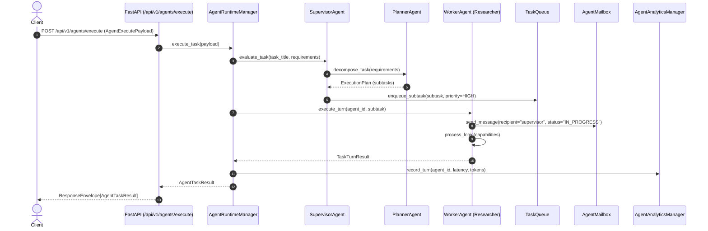

# End-to-End Walkthrough: Multi-Agent Task Execution & Delegation

This document provides a source-verified trace of how multi-agent task execution, sub-task delegation, and inter-agent mailbox communication operate in the VOLTA AI Platform.

---

## 📍 Entry Points & Endpoints

- **Execute Agent Task**: `POST /api/v1/agents/execute` ([backend/app/api/v1/routers/agents.py](file:///c:/Users/Likit/Desktop/Volta-AI-Chatbot/backend/app/api/v1/routers/agents.py#L41))
- **Delegate Sub-Task**: `POST /api/v1/agents/delegate` ([backend/app/api/v1/routers/agents.py](file:///c:/Users/Likit/Desktop/Volta-AI-Chatbot/backend/app/api/v1/routers/agents.py#L61))
- **Inter-Agent Message**: `POST /api/v1/agents/message` ([backend/app/api/v1/routers/agents.py](file:///c:/Users/Likit/Desktop/Volta-AI-Chatbot/backend/app/api/v1/routers/agents.py#L78))
- **Enqueue Priority Task**: `POST /api/v1/agents/task` ([backend/app/api/v1/routers/agents.py](file:///c:/Users/Likit/Desktop/Volta-AI-Chatbot/backend/app/api/v1/routers/agents.py#L95))

---

## 🔄 End-to-End Multi-Agent Architecture Sequence



---

## 🔍 Detailed Workflow Stage Breakdown

### 1. Agent Registration & Instance Lifecycle
- Agents are registered via `POST /api/v1/agents/register` ([backend/app/api/v1/routers/agents.py](file:///c:/Users/Likit/Desktop/Volta-AI-Chatbot/backend/app/api/v1/routers/agents.py#L24)) accepting `AgentRegisterPayload` (`name`, `role`, `capabilities`, `budget`).
- `AgentRuntimeManager` ([backend/app/agents/manager.py](file:///c:/Users/Likit/Desktop/Volta-AI-Chatbot/backend/app/agents/manager.py)) instantiates `AgentInstance` ([backend/app/agents/agent.py](file:///c:/Users/Likit/Desktop/Volta-AI-Chatbot/backend/app/agents/agent.py)) assigning assigned role (`SUPERVISOR`, `PLANNER`, `WORKER`, `COORDINATOR`).

### 2. Task Orchestration & Decomposition
- When executing `POST /api/v1/agents/execute`, `AgentRuntimeManager.execute_task()` validates `agent_id` and budget limits ([backend/app/agents/budget.py](file:///c:/Users/Likit/Desktop/Volta-AI-Chatbot/backend/app/agents/budget.py)).
- If target is a `SupervisorAgent` ([backend/app/agents/supervisor.py](file:///c:/Users/Likit/Desktop/Volta-AI-Chatbot/backend/app/agents/supervisor.py)), it delegates requirement breakdown to `PlannerAgent` ([backend/app/agents/planner.py](file:///c:/Users/Likit/Desktop/Volta-AI-Chatbot/backend/app/agents/planner.py)) generating a multi-step `ExecutionPlan`.

### 3. Task Priority Enqueueing
- Sub-tasks are enqueued into `TaskQueue` ([backend/app/agents/queue.py](file:///c:/Users/Likit/Desktop/Volta-AI-Chatbot/backend/app/agents/queue.py)) sorted by priority integer (`CRITICAL` = 1, `HIGH` = 2, `MEDIUM` = 3, `LOW` = 4).

### 4. Sub-Task Delegation between Agents
- Delegations requested via `POST /api/v1/agents/delegate` pass `AgentDelegatePayload` (`delegator_agent_id`, `delegatee_agent_id`, `subtask_title`, `deadline`) to `DelegationManager` ([backend/app/agents/delegation.py](file:///c:/Users/Likit/Desktop/Volta-AI-Chatbot/backend/app/agents/delegation.py)).
- Confirms `delegatee` capabilities match required skills before transferring ownership.

### 5. Inter-Agent Communication (AgentMailbox)
- Messages sent via `POST /api/v1/agents/message` pass `AgentMessagePayload` to `CommunicationManager` ([backend/app/agents/communication.py](file:///c:/Users/Likit/Desktop/Volta-AI-Chatbot/backend/app/agents/communication.py)).
- Delivers structured `AgentMessage` into target agent's `AgentMailbox` ([backend/app/agents/mailbox.py](file:///c:/Users/Likit/Desktop/Volta-AI-Chatbot/backend/app/agents/mailbox.py)) supporting `DIRECT`, `BROADCAST`, and `REQUEST_RESPONSE` patterns.

### 6. Analytics & Health Monitoring
- Telemetry metrics (execution time, tokens, task completion rate) are recorded in `AgentAnalyticsManager` ([backend/app/agents/analytics.py](file:///c:/Users/Likit/Desktop/Volta-AI-Chatbot/backend/app/agents/analytics.py)).
- Health status is monitored continuously by `AgentHealthManager` ([backend/app/agents/health.py](file:///c:/Users/Likit/Desktop/Volta-AI-Chatbot/backend/app/agents/health.py)).

---

## 📤 Output Response Structure

```json
{
  "success": true,
  "data": {
    "task_id": "task_8821",
    "agent_id": "agent_supervisor_01",
    "status": "COMPLETED",
    "output": "Multi-agent research and summary report generated...",
    "subtasks_executed": 3,
    "metrics": {
      "execution_time_ms": 320,
      "total_tokens": 480,
      "messages_exchanged": 5
    }
  },
  "message": "Task 'Market Analysis' executed by agent 'agent_supervisor_01'.",
  "error": null
}
```
