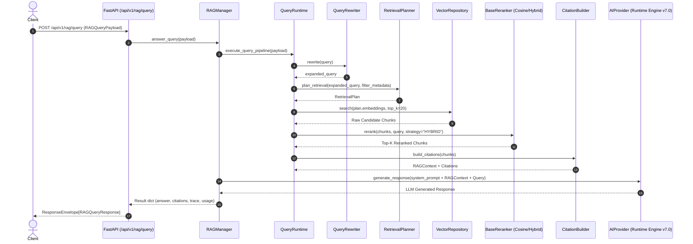

# End-to-End Walkthrough: RAG Context Retrieval & Query Answering

This document provides a source-verified trace of how RAG context retrieval and augmented query answering operate in the VOLTA AI Platform.

---

## 📍 Entry Point & Request Payloads

- **HTTP Method & Route**: `POST /api/v1/rag/query` ([backend/app/api/v1/routers/rag.py](file:///c:/Users/Likit/Desktop/Volta-AI-Chatbot/backend/app/api/v1/routers/rag.py#L131-L142))
- **Request Schema**: `RAGQueryPayload` ([backend/app/rag/contracts.py](file:///c:/Users/Likit/Desktop/Volta-AI-Chatbot/backend/app/rag/contracts.py))
  ```json
  {
    "query": "What is the cancellation policy for bookings?",
    "top_k": 5,
    "rerank_strategy": "HYBRID",
    "filter_metadata": {"category": "policy"}
  }
  ```

---

## 🔄 End-to-End Execution Sequence



---

## 🔍 Detailed Workflow Stage Breakdown

### 1. Request Dispatching
- FastAPI router `answer_rag_query()` in [backend/app/api/v1/routers/rag.py](file:///c:/Users/Likit/Desktop/Volta-AI-Chatbot/backend/app/api/v1/routers/rag.py#L131) dispatches payload to `_rag_manager.answer_query(payload)`.

### 2. Query Rewriting & Expansion
- `RAGManager` ([backend/app/rag/manager.py](file:///c:/Users/Likit/Desktop/Volta-AI-Chatbot/backend/app/rag/manager.py)) invokes `QueryRuntime` / `QueryRewriter` ([backend/app/rag/retrieval/query.py](file:///c:/Users/Likit/Desktop/Volta-AI-Chatbot/backend/app/rag/retrieval/query.py)) to normalize whitespace, extract key entities, and generate query expansion variants.

### 3. Retrieval Planning
- `RetrievalPlanner` ([backend/app/rag/retrieval/planner.py](file:///c:/Users/Likit/Desktop/Volta-AI-Chatbot/backend/app/rag/retrieval/planner.py)) creates a `RetrievalPlan` specifying candidate pool size (e.g. `oversample_factor = 4` ➔ 20 candidates for `top_k = 5`) and metadata filter expressions.

### 4. Vector Similarity Search
- Calls `VectorRepository.similarity_search()` ([backend/app/rag/storage/vector_repo.py](file:///c:/Users/Likit/Desktop/Volta-AI-Chatbot/backend/app/rag/storage/vector_repo.py)) querying indexed document chunks using cosine distance or dot-product vector matching.

### 5. Reranking Pipeline
- Passes raw candidates to `Reranker` ([backend/app/rag/retrieval/reranker.py](file:///c:/Users/Likit/Desktop/Volta-AI-Chatbot/backend/app/rag/retrieval/reranker.py)) evaluating candidate relevance based on selected strategy (`COSINE`, `HYBRID`, or `CROSS_ENCODER`). Scores and trims candidates down to top `top_k` chunks.

### 6. Citation Construction & Context Assembly
- `CitationBuilder` ([backend/app/rag/retrieval/citations.py](file:///c:/Users/Likit/Desktop/Volta-AI-Chatbot/backend/app/rag/retrieval/citations.py)) formats matched chunks into structured `RAGContext` with source document titles, chunk IDs, page numbers, and relevance scores.

### 7. LLM Context-Augmented Generation
- Delegates context-augmented prompt to Runtime Engine (`AIProvider.generate_response()`), enforcing strict grounded generation based on retrieved context chunks.

---

## 📤 Output Response Structure

```json
{
  "success": true,
  "data": {
    "query": "What is the cancellation policy for bookings?",
    "answer": "Bookings can be cancelled up to 24 hours prior to check-in for a full refund...",
    "citations": [
      {
        "citation_id": "cit_001",
        "document_id": "doc_policy_2026",
        "title": "Cancellation Policy 2026",
        "snippet": "Full refund available if cancelled 24h prior...",
        "relevance_score": 0.94
      }
    ],
    "retrieval_trace": {
      "strategy_used": "HYBRID",
      "candidates_scanned": 20,
      "chunks_returned": 5,
      "execution_time_ms": 42
    }
  },
  "message": "RAG query answered successfully.",
  "error": null
}
```
