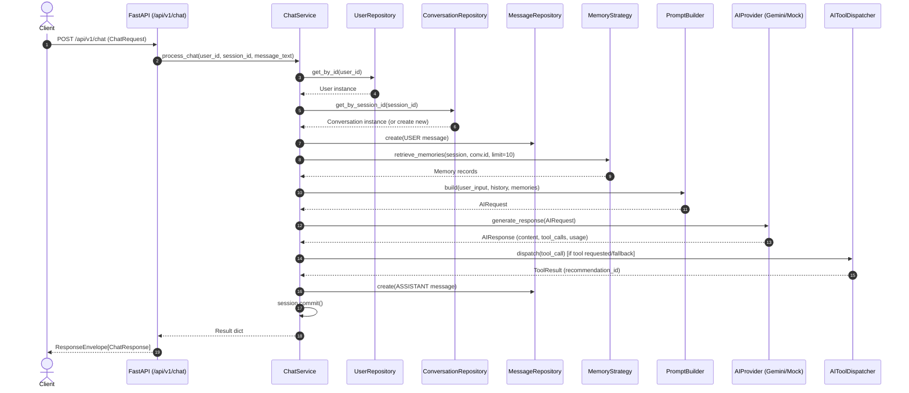

# End-to-End Walkthrough: Standard Chat Request Execution

This document provides a source-verified, step-by-step trace of how a conversational chat turn is processed in the VOLTA AI Platform.

---

## 📍 Entry Point & Request Payload

- **HTTP Method & Route**: `POST /api/v1/chat` ([backend/app/api/v1/routers/chat.py](file:///c:/Users/Likit/Desktop/Volta-AI-Chatbot/backend/app/api/v1/routers/chat.py#L12-L31))
- **Request Schema**: `ChatRequest` ([backend/app/schemas/chat.py](file:///c:/Users/Likit/Desktop/Volta-AI-Chatbot/backend/app/schemas/chat.py#L28-L33))
  ```json
  {
    "user_id": "3fa85f64-5717-4562-b3fc-2c963f66afa6",
    "session_id": "session_web_001",
    "message": "Can you recommend a hotel booking?"
  }
  ```

---

## 🔄 End-to-End Execution Sequence



---

## 🔍 Detailed Workflow Stage Breakdown

### 1. Request Handling & Dependency Injection
- FastAPI route handler `process_chat()` in [backend/app/api/v1/routers/chat.py](file:///c:/Users/Likit/Desktop/Volta-AI-Chatbot/backend/app/api/v1/routers/chat.py#L19) receives `payload: ChatRequest` and injects `ChatService` via `get_chat_service` ([backend/app/api/dependencies.py](file:///c:/Users/Likit/Desktop/Volta-AI-Chatbot/backend/app/api/dependencies.py)).

### 2. User & Session Validation
- `ChatService.process_chat()` ([backend/app/services/chat.py](file:///c:/Users/Likit/Desktop/Volta-AI-Chatbot/backend/app/services/chat.py#L52)) checks if `user_id` exists via `UserRepository.get_by_id()`. Raises `UserNotFoundException` if missing.
- Looks up active conversation session using `ConversationRepository.get_by_session_id()`. If non-existent, creates a new `Conversation` with `ConversationSource.WEB` and `ConversationStatus.ACTIVE`.

### 3. User Message Persistence
- Saves the incoming user message turn to PostgreSQL DB via `MessageRepository.create()` with `role=MessageRole.USER`.

### 4. Memory Strategy Retrieval
- Invokes `MemoryStrategy.retrieve_memories()` ([backend/app/ai/memory/base.py](file:///c:/Users/Likit/Desktop/Volta-AI-Chatbot/backend/app/ai/memory/base.py)) via `MemoryStrategyFactory` ([backend/app/ai/memory/factory.py](file:///c:/Users/Likit/Desktop/Volta-AI-Chatbot/backend/app/ai/memory/factory.py)) to fetch top relevant memory records for `conv.id`.

### 5. Recent History Retrieval & Prompt Construction
- Executes SQLAlchemy query `select(Message)` ordering by `created_at.asc()` (limit 20) to fetch recent conversation turns.
- Calls `PromptBuilder.build()` ([backend/app/ai/prompts/prompt_builder.py](file:///c:/Users/Likit/Desktop/Volta-AI-Chatbot/backend/app/ai/prompts/prompt_builder.py)) assembling system prompt, conversation history, memories, and current user input into an `AIRequest`.

### 6. Provider Execution (LLM Generation)
- Calls `self.provider.generate_response(ai_request)` ([backend/app/ai/factory.py](file:///c:/Users/Likit/Desktop/Volta-AI-Chatbot/backend/app/ai/factory.py)), dispatching to `GeminiProvider` (using official `google-genai` SDK) or `MockProvider`.
- Returns an `AIResponse` containing generated content, usage metrics (`prompt_tokens`, `completion_tokens`), and tool call requests.

### 7. Tool Dispatching & Intent Fallback
- If `ai_response.tool_calls` exist or intent helper `is_recommendation_requested(message_text)` triggers, `ChatService` dispatches the call via `AIToolDispatcher.dispatch()` ([backend/app/ai/tools/dispatcher.py](file:///c:/Users/Likit/Desktop/Volta-AI-Chatbot/backend/app/ai/tools/dispatcher.py)) executing registered tools like `RecommendationTool`.

### 8. Assistant Turn Persistence & Transaction Commit
- Saves assistant response to database with `role=MessageRole.ASSISTANT`, model name, token count, and sequence number.
- Executes `await self.commit()` closing the database transaction boundary.

---

## 📤 Output Response Structure

- **Response DTO**: `ChatResponse` wrapped in standard `ResponseEnvelope` ([backend/app/schemas/common.py](file:///c:/Users/Likit/Desktop/Volta-AI-Chatbot/backend/app/schemas/common.py)):
  ```json
  {
    "success": true,
    "data": {
      "conversation_id": "8f3b2a1c-4d5e-6f7a-8b9c-0d1e2f3a4b5c",
      "session_id": "session_web_001",
      "message": {
        "role": "assistant",
        "content": "I recommend booking Grand Hotel...",
        "model_used": "gemini-2.5-flash",
        "token_count": 142,
        "created_at": "2026-08-10T14:30:00Z"
      },
      "recommendation_id": "1a2b3c4d-5e6f-7a8b-9c0d-1e2f3a4b5c6d",
      "usage": {
        "prompt_tokens": 85,
        "completion_tokens": 57,
        "total_tokens": 142
      }
    },
    "message": "Chat message processed successfully.",
    "error": null
  }
  ```
